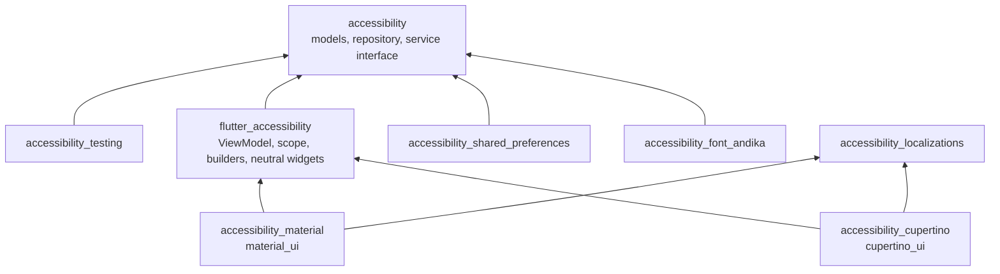

# Architecture

The `accessibility` family follows the MVVM layering of the official
[Flutter architecture guide](https://docs.flutter.dev/app-architecture): a
UI layer of Views and ViewModels, a Data layer of Repositories and
Services, and domain models in between. Version 2.0 makes each layer a
package, so an app depends on the layers it needs and nothing else.

## Layers and packages

| Layer | Package | Classes |
|---|---|---|
| Domain models | `accessibility` | `AccessibilitySettings`, `TextSettings`, `ColorSettings`, enums, profiles, `AccessibleFont` |
| Data: Service | `accessibility` (interface), `accessibility_shared_preferences` (implementation) | `AccessibilityStorageService` |
| Data: Repository | `accessibility` | `AccessibilitySettingsRepository` |
| UI: ViewModel | `flutter_accessibility` | `AccessibilitySettingsViewModel` |
| UI: neutral Views | `flutter_accessibility` | `AccessibilityScope`, builders, `AccessibleText` and other widgets |
| UI: Material Views | `accessibility_material` | theme builder, settings panel |
| UI: Cupertino Views | `accessibility_cupertino` | theme builder, settings panel, routes |

## The dependency rule

View -> ViewModel -> Repository -> Service. A View never touches the
repository or a service: it reads state and invokes commands through the
ViewModel. Views may read `MediaQuery` — the guide allows layout logic
based on device information in the View — which is how the OS signals
(platform brightness, reduce motion, increase contrast) enter the tree.

Pure data transformations live on the models (`copyWith`,
`withThemeProfile`, `withNextColorProfile`, `fromJson` / `toJson`). There
are no use-case classes: there is one ViewModel and the shared logic fits
on the models.

## The package graph



`accessibility_localizations` has no edge to the core: it depends on
`flutter` and `intl` only, so an app can use the strings without the
models, and the core never pulls in translations.

## Folder layout

Every package uses the guide's folders, creating only the ones it needs
(the core has no `ui/`, the UI packages have no `data/`):

```text
lib/src/domain/models/
lib/src/data/repositories/
lib/src/data/services/
lib/src/ui/core/
lib/src/ui/<feature>/view_model/
lib/src/ui/<feature>/widgets/
```

`lib/src/ui/core/` holds cross-feature UI helpers, the guide's own
convention. A feature's non-widget, non-ViewModel helpers — for example
`AccessibleHeight`, the panel configuration and the panel style — live at
the feature root.

## The layers, one by one

### `accessibility`: models and Data layer

Pure Dart. `AccessibilitySettings` is the immutable aggregate of
`themeMode` (`AccessibilityThemeMode`), `effectsMode` (`EffectsMode`),
`TextSettings` and `ColorSettings`. `ThemeProfile` and `ColorProfile` are
the named presets, resolved from their `ThemeProfileLevel` and
`ColorProfileLevel`.

`AccessibilitySettingsRepository` is the single source of truth. It holds
the settings and the load status as `ValueListenable`s, and `load`, `save`
and `clear` are its only mutations; `AccessibilitySettingsStatus` is the
sealed outcome of the last load (`Idle`, `Loading`, `Loaded`,
`LoadFailed`). A repository built without a service keeps everything in
memory.

`AccessibilityStorageService` is the persistence contract: `read`, `write`,
`clear`. The core never imports `package:flutter` or `dart:ui`; an
architecture test in the package reads every file under `lib/` and fails on
either import.

### `accessibility_shared_preferences`: the Service implementation

`SharedPreferencesAccessibilityStorageService` implements the contract on
`shared_preferences`, with the keys `accessibility` 1.x already wrote, so
an upgraded install finds its settings. The adapter knows nothing about
widgets. `.legacy()` selects the legacy `SharedPreferences` backend, which
on Android stores its values elsewhere than
`SharedPreferencesWithCache`.

### `flutter_accessibility`: the ViewModel and the neutral Views

`AccessibilitySettingsViewModel` is a `ChangeNotifier` over the
repository. It exposes `settings`, `status`, the registered
`accessibleFonts` and `activeFont`, and one command per setting
(`setThemeMode`, `setEffectsMode`, `setTextScaleFactor`, `setLineHeight`,
`setLetterSpacing`, `setWordSpacing`, `setBold`, `setTextAlign`,
`setTextColor`, `setFontFamily`, `setAccessibleFontEnabled`,
`setBackgroundColor`, `setColorProfile`, `nextColorProfile`,
`applyThemeProfile`, `restoreDefaults`).

`AccessibilityScope` is an `InheritedNotifier` over that ViewModel:
`of(context)` returns it without registering a dependency (for commands),
`settingsOf` and `statusOf` register one (for rebuilds), and
`effectsEnabledOf` resolves the effects mode against
`MediaQuery.disableAnimationsOf`. `AccessibilitySettingsBuilder` and
`EffectsBuilder` are the builder form of the last three.

The rest is design-system-free UI: `AccessibleTextStyle.applyTextSettings`
and `AccessibleColor.withColorProfile`, the two transformations every theme
package uses; `kDefaultColorCandidates`, the 19 Material primary swatches
as plain `ColorSwatch<int>`s built on `painting` only; and the widgets
`AccessibleText`, `AccessibleWidgetBuilder`, `AccessibleSizedBox`,
`AccessibleHeight`, `CollapsibleText` and `TextRawMagnifier`. The package
depends on `package:flutter/widgets.dart` only.

### `accessibility_material` / `accessibility_cupertino`: the themed Views

Both apply the settings the same way, and differ only in the widgets.

- **Text** goes through `AccessibleTextStyle.applyTextSettings`, applied to
  every style of the theme's text themes. This is why `AccessibleText`
  handles alignment and colour only: the ambient style already carries the
  scale, spacing, weight and family, and re-applying them in the widget
  would scale the text twice.
- **Colours** go through `AccessibleColor.withColorProfile`, applied
  variant by variant so dynamic Cupertino colours still resolve for dark
  mode and elevation. The settings' background colour replaces the page
  background; the settings' text colour overrides the foreground.
- **Motion**: `AccessiblePageTransitionsTheme` is installed by the Material
  theme, and `AccessibleCupertinoPageRoute` / `AccessibleCupertinoPage`
  replace their Cupertino counterparts. Both skip the transition when the
  effects mode is `disabled` or the OS reduces motion.

`AccessibleThemeBuilder` yields an `AccessibleThemes` — `light`, `dark`,
`highContrastLight`, `highContrastDark` and the `ThemeMode` — because
`MaterialApp` picks the high-contrast variants itself when the OS asks for
more contrast. `AccessibleCupertinoThemeBuilder` yields a single
`CupertinoThemeData`, because `CupertinoApp` has no such slots: the builder
composes the high-contrast profile itself. The transformation behind both
is available on its own as `AccessibleThemeData.from` and
`AccessibleCupertinoThemeData.from`, for apps that build their themes
elsewhere.

`AccessibilitySettingsPanel` and `CupertinoAccessibilitySettingsPanel`
share `AccessibilitySettingsConfiguration` (which settings are shown, which
colours are offered, `onRestoreSettings`) and `AccessibilitySettingsStyle`
(`standard` or `cards`). Their default colour candidates are the same 19
Material primary swatches, reached through `material_ui`'s `Colors` on one
side and through `kDefaultColorCandidates` on the other.

### One import is enough

`accessibility_material` and `accessibility_cupertino` re-export
`flutter_accessibility`, which re-exports `accessibility`, and both
re-export `AccessibilityLocalizations`. A Material or Cupertino app
therefore imports one library for the models, the ViewModel, the scope, the
builders, the widgets, the theme and the panel.

The core deliberately does not re-export the `listen` types. Re-exporting
`ValueListenable` would make the name ambiguous for anyone who also imports
Flutter, until stable unifies the two; code that has to name the type
imports `package:listen/listen.dart` itself.

## Testing

100% line coverage is a CI gate on the packages where the logic lives:
`accessibility`, `accessibility_testing`, `flutter_accessibility` and
`accessibility_shared_preferences`. The melos script `coverage:check` runs
the same gate locally.

The other four packages have no coverage gate.

`accessibility_material` and `accessibility_cupertino` are tested by
rendering and by Flutter's accessibility guidelines, in both panel styles,
with the defaults and with every setting active, scrolling the panel so
that every item is evaluated at least once. The Material panel runs
`labeledTapTargetGuideline`, `androidTapTargetGuideline` and
`textContrastGuideline`; the Cupertino panel runs
`labeledTapTargetGuideline`, `iOSTapTargetGuideline` and
`textContrastGuideline`, every scenario in both brightnesses, because an
unresolved `CupertinoDynamicColor` keeps its light variant whatever the
brightness and only a dark run catches it.

`accessibility_localizations` and `accessibility_font_andika` have no
guideline tests. The first checks that the delegate loads every supported
locale and rejects the rest, that every ARB declares its locale and carries
exactly the template's keys, that the untranslated report is empty, and
that `lib/` depends on `widgets.dart` and `intl` only. The second checks
that the constant names the packaged family, that the four faces are
declared and bundled, and that the Open Font License ships with them.

The four example apps run the same three-guideline check over their pages:
the Cupertino example with `iOSTapTargetGuideline`, the other three with
`androidTapTargetGuideline`. Only `examples/multiple_languages` renders a
right-to-left locale (`ar`), and there its custom settings page skips the
contrast check, which reports a false positive on one row under RTL.

`accessibility_testing` provides `FakeAccessibilityStorageService`, an
in-memory service that records its calls and can be told to throw, and
`AccessibilitySettingsSamples`, ready-made settings values.
