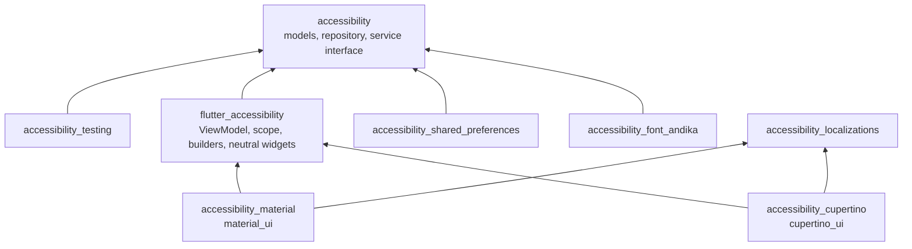

# accessibility 2.0, Plan 6 of 6: examples, deploy, docs, release

> **For agentic workers:** REQUIRED SUB-SKILL: Use superpowers:subagent-driven-development (recommended) or superpowers:executing-plans to implement this plan task-by-task. Steps use checkbox (`- [ ]`) syntax for tracking.

**Goal:** Finish the 2.0 split: replace the 1.x example apps with the four
2.0 examples, deploy the Material and Cupertino ones to GitHub Pages, ship
the documentation (family README, architecture, migration guide, package
READMEs, changelogs, dartdoc checks), the pana tooling, and verify the
release so `release/2.0` can merge into `master` and the eight packages can
be published.

**Architecture:** Examples are Flutter web apps under `examples/`, workspace
members that depend on the packages through `^2.0.0` constraints resolved
locally. Each keeps MVVM: views read `AccessibilityScope.settingsOf` and call
ViewModel commands; the storage service is `accessibility_shared_preferences`.
The deploy workflow builds two apps with distinct base hrefs into one site
tree pushed to the `accessibility_web` branch that GitHub Pages already
serves. Tooling stays in `tool/` as Dart scripts invoked by melos and CI.

**Tech Stack:** Flutter >= 3.44 (stable), Dart ^3.12, melos 7, go_router
^16, `material_ui` ^1.1, `cupertino_ui` ^1.0, GitHub Actions, GitHub Pages,
pana.

**Spec:** `docs/superpowers/specs/2026-09-04-accessibility-2-0-monorepo-design.md`
(sections 3, 15, 16, 17, 18, 21 drive this plan).

**Plan series:** 1 foundation and core (PR #13) · 2 `flutter_accessibility`
(PRs #14, #15) · 3 localizations, shared_preferences, font (PRs #16, #17) ·
4 `accessibility_material` (PR #18) · 5 `accessibility_cupertino` (PR #19) ·
6 examples, deploy, docs, release (this).

**State on branch start (2026-09-11):** `release/2.0` = 06c7c5d holds the
eight packages, each at 2.0.0 with a `## 2.0.0` CHANGELOG entry, a README
and (except `accessibility_testing`) a single-file `example/main.dart`. The
root still carries the 1.x `example/` folder (`basic`, `with_custom_ui`,
`with_multiple_languages`, all broken against 2.0) and the 1.x `README.md`;
`.github/workflows/deploy.yml` builds `example/with_multiple_languages` and
force-pushes `build/web` to branch `accessibility_web`; `build.yml` runs the
package matrix with `pana: true` only for `accessibility`. Branch `1.x` is
pushed. `master` is still 1.4.0.

## Global Constraints

- Dart SDK `^3.12.0`; Flutter `>=3.44.0`. Every example: `publish_to: none`,
  `resolution: workspace`, registered in the root `pubspec.yaml` workspace
  list, `analysis_options.yaml` = `include: ../../analysis_options.yaml`,
  lint-clean under `dart analyze --fatal-infos --fatal-warnings .` and
  `dart format --set-exit-if-changed .`; the web platform only (`web/`
  generated by `flutter create`, no android/ios/desktop folders); a
  `README.md`; a `test/` directory with at least the accessibility-guideline
  test of its screens.
- Example names and paths: `examples/material` (`material_example`),
  `examples/cupertino` (`cupertino_example`), `examples/custom_ui`
  (`custom_ui_example`), `examples/multiple_languages`
  (`multiple_languages_example`). Dependencies: `material` and
  `multiple_languages` depend on `accessibility_material`,
  `accessibility_shared_preferences`, `accessibility_font_andika`,
  `material_ui`, `go_router`, `flutter`; `cupertino` on
  `accessibility_cupertino`, `accessibility_shared_preferences`,
  `accessibility_font_andika`, `cupertino_ui`, `flutter`; `custom_ui` only on
  `flutter_accessibility`, `accessibility_shared_preferences`, `flutter`.
  Dev dependencies: `flutter_test`, `accessibility_testing` (workspace).
- MVVM in the examples too: views read state through
  `AccessibilityScope.settingsOf` / `statusOf`, invoke commands through
  `AccessibilityScope.of`; no view touches the repository or a service after
  start-up. Blocking init only: `await repository.load()` before `runApp`.
- The 1.x `example/` folder is deleted in Task 5, after Tasks 1 to 4 have
  copied what they need from it (colour schemes, the country list).
- GitHub Pages keeps serving branch `accessibility_web` from its root: the
  deploy workflow pushes one tree with `index.html` (landing), `material/`
  and `cupertino/` built with `--base-href /accessibility/material/` and
  `/accessibility/cupertino/`.
- pana runs on a temporary copy of each package (`resolution: workspace`
  removed, `accessibility_testing` dev dependency removed), through
  `tool/run_pana.dart` shared by the melos `pana` script and CI. The CI
  `pana:` flags stay as they are in this plan (only `accessibility`), because
  pana resolves dependencies from pub.dev and verifies the `repository` URL
  against `master`; they are flipped to `true` by a follow-up PR after the
  family is published (see Release steps).
- Docs: root `README.md` is the family landing page (objection paragraph,
  package table with pub badges, three entry points with snippets, live demo
  and examples links); `docs/architecture.md`; `docs/migration/1.x-to-2.0.md`
  (the spec's rename table plus before/after for the three entry points and
  the stored-settings note); every package README has Installation and Usage
  and links to the live demo; the `accessibility` CHANGELOG has the "where
  did it go" table. No screenshot images are added in this plan (the 1.x
  `screenshots/settings_*.webp` show the 1.x UI and are not referenced by 2.0
  docs; capturing 2.0 screenshots is a manual follow-up).
- Every public member documented (`public_member_api_docs` is on for the
  examples too); 80-column lines (import URIs exempt); trailing commas;
  `prefer_expression_function_bodies`; `avoid_positional_boolean_parameters`;
  `prefer_const_constructors`; `avoid_redundant_argument_values`. Infos are
  fatal.
- Commits follow Conventional Commits with scopes `examples`, `ci`, `docs`,
  `tooling`; no `Co-Authored-By` trailer, no session link, no "generated
  with" line. Work happens on branch `chore/examples-docs-release-2-0` (from
  `release/2.0`) in the worktree `.claude/worktrees/feat-flutter-accessibility`;
  it lands in `release/2.0` through a pull request.
- Every `git` command is its own plain Bash call (no `&&`, `;`, pipes or
  command substitution around it). Never `git stash`. melos runs as
  `dart run melos run <cmd>` from the workspace root; `flutter pub get` at the
  root resolves the whole workspace; run the full test suite of a Flutter
  package with `flutter test -j 1` (the concurrent reporter garbles names on
  this machine).

---

### Task 1: `examples/material` (the 1.x `basic` app on 2.0), workspace and CI for examples

**Files:**
- Create: `examples/material/pubspec.yaml`, `examples/material/analysis_options.yaml`,
  `examples/material/README.md`, `examples/material/web/` (generated),
  `examples/material/lib/main.dart`, `examples/material/lib/theme/color_schemes.dart`,
  `examples/material/lib/pages/home_page.dart`, `examples/material/lib/pages/settings_page.dart`,
  `examples/material/test/accessibility_guidelines_test.dart`
- Modify: `pubspec.yaml` (root, workspace list), `.gitignore`,
  `.github/workflows/build.yml` (new `examples` job)

**Interfaces:**
- Produces: the example layout every later example mirrors (`lib/main.dart`
  bootstrap, `lib/pages/`, `test/accessibility_guidelines_test.dart`) and
  the CI `examples` job whose matrix Tasks 2 to 4 extend.

- [ ] **Step 1: Generate the app skeleton**

From the workspace root:

```bash
flutter create --platforms web --project-name material_example --empty --no-pub examples/material
```

Then delete what the generator wrote that this task replaces: `lib/main.dart`
(rewritten below), `test/` contents, `README.md` (rewritten), `.metadata`,
`analysis_options.yaml` (rewritten). Keep `web/` and `.gitignore`. In
`web/index.html` set `<title>Accessible Material app</title>` and in
`web/manifest.json` set `"name": "Accessible Material app"` and
`"short_name": "Material"`, `"description": "accessibility_material example"`.

- [ ] **Step 2: Write the pubspec, lint include and workspace entries**

`examples/material/pubspec.yaml`:

```yaml
name: material_example
description: The accessibility_material example app, deployed as the live demo.
publish_to: none
resolution: workspace

environment:
  sdk: ^3.12.0
  flutter: ">=3.44.0"

dependencies:
  accessibility_font_andika: ^2.0.0
  accessibility_material: ^2.0.0
  accessibility_shared_preferences: ^2.0.0
  flutter:
    sdk: flutter
  go_router: ^16.0.0
  material_ui: ^1.1.0

dev_dependencies:
  accessibility_testing: ^2.0.0
  flutter_test:
    sdk: flutter

flutter:
  uses-material-design: true
```

`examples/material/analysis_options.yaml`: `include: ../../analysis_options.yaml`.

Root `pubspec.yaml`: append to `workspace:` after the packages:

```yaml
  - examples/material
```

Root `.gitignore`: after `*/build/` add `**/build/` (the examples' build
folders are two levels deep).

Run: `flutter pub get` (root). Expected: resolves; `go_router` 16.x added to
the lockfile.

- [ ] **Step 3: Write the theme and the bootstrap**

`examples/material/lib/theme/color_schemes.dart`: copy the four `ColorScheme`
constants from `example/basic/lib/constants/theme/color_schemes.dart`
verbatim (every colour value unchanged), importing
`package:material_ui/material_ui.dart` instead of `flutter/material.dart`,
renaming `kHighConstrastLightColorScheme` → `kHighContrastLightColorScheme`
and `kHighConstrastDarkColorScheme` → `kHighContrastDarkColorScheme`, each
constant documented (`/// The light colour scheme of the app.` and so on).

`examples/material/lib/main.dart`:

```dart
import 'package:accessibility_font_andika/accessibility_font_andika.dart';
import 'package:accessibility_material/accessibility_material.dart';
import 'package:accessibility_shared_preferences/accessibility_shared_preferences.dart';
import 'package:go_router/go_router.dart';
import 'package:material_example/pages/home_page.dart';
import 'package:material_example/pages/settings_page.dart';
import 'package:material_example/theme/color_schemes.dart';
import 'package:material_ui/material_ui.dart';

Future<void> main() async {
  WidgetsFlutterBinding.ensureInitialized();
  final repository = AccessibilitySettingsRepository(
    service: SharedPreferencesAccessibilityStorageService(),
  );
  await repository.load();
  runApp(
    AccessibilityScope(
      viewModel: AccessibilitySettingsViewModel(
        repository: repository,
        accessibleFonts: const [AndikaFont.font],
      ),
      child: const ExampleApp(),
    ),
  );
}

/// The routes of the app.
final GoRouter router = GoRouter(
  routes: [
    GoRoute(
      path: '/',
      builder: (context, state) => const HomePage(),
      routes: [
        for (final variant in SettingsVariant.values)
          GoRoute(
            path: 'settings/${variant.name}',
            builder: (context, state) => SettingsPage(variant: variant),
          ),
      ],
    ),
  ],
);

/// The example app: a `MaterialApp.router` whose themes follow the
/// accessibility settings.
final class ExampleApp extends StatelessWidget {
  /// Creates the app.
  const ExampleApp({super.key});

  @override
  Widget build(BuildContext context) => AccessibleThemeBuilder(
    theme: ThemeData(colorScheme: kLightColorScheme),
    darkTheme: ThemeData(colorScheme: kDarkColorScheme),
    builder: (context, themes) => MaterialApp.router(
      title: 'Accessible Material app',
      theme: themes.light,
      darkTheme: themes.dark,
      highContrastTheme: AccessibleThemeData.from(
        themeData: ThemeData(colorScheme: kHighContrastLightColorScheme),
        settings: AccessibilityScope.settingsOf(context),
        font: AccessibilityScope.of(context).activeFont,
      ),
      highContrastDarkTheme: AccessibleThemeData.from(
        themeData: ThemeData(colorScheme: kHighContrastDarkColorScheme),
        settings: AccessibilityScope.settingsOf(context),
        font: AccessibilityScope.of(context).activeFont,
      ),
      themeMode: themes.mode,
      localizationsDelegates: const [
        ...GlobalMaterialLocalizations.delegates,
        AccessibilityLocalizations.delegate,
      ],
      supportedLocales: AccessibilityLocalizations.supportedLocales,
      routerConfig: router,
    ),
  );
}
```

The app provides its own high-contrast schemes (as the 1.x example did), so
it builds those two themes itself with the settings applied instead of the
builder's `highContrastLight`/`highContrastDark` (which are the light/dark
themes with the high-contrast profile forced); the README explains both
options.

- [ ] **Step 4: Write the pages**

`examples/material/lib/pages/home_page.dart`:

```dart
import 'package:accessibility_material/accessibility_material.dart';
import 'package:go_router/go_router.dart';
import 'package:material_example/pages/settings_page.dart';
import 'package:material_ui/material_ui.dart';

const _sample =
    'The quick brown fox jumps over the lazy dog. Sphinx of black quartz, '
    'judge my vow. Pack my box with five dozen liquor jugs.';

/// The home page: sample content that reacts to the settings, and links to
/// the three settings pages.
final class HomePage extends StatelessWidget {
  /// Creates the page.
  const HomePage({super.key});

  @override
  Widget build(BuildContext context) {
    final l10n = AccessibilityLocalizations.of(context);
    return Scaffold(
      appBar: AppBar(title: Text(l10n.accessibility)),
      body: ListView(
        padding: const EdgeInsets.all(16),
        children: [
          Text('Sample content', style: Theme.of(context).textTheme.titleLarge),
          const AccessibleSizedBox.fromHeight(height: 8),
          const AccessibleText(_sample),
          const AccessibleSizedBox.fromHeight(height: 16),
          const TextRawMagnifier(child: AccessibleText(_sample)),
          const AccessibleSizedBox.fromHeight(height: 16),
          const ReadMoreText(text: '$_sample $_sample $_sample'),
          const AccessibleSizedBox.fromHeight(height: 16),
          EffectsBuilder(
            builder: (context, {required effectsEnabled, child}) => Row(
              spacing: 8,
              children: [
                Icon(effectsEnabled ? Icons.animation : Icons.motion_photos_off),
                Expanded(
                  child: AccessibleText(
                    effectsEnabled
                        ? 'Effects are enabled: transitions animate.'
                        : 'Effects are disabled: transitions are skipped.',
                  ),
                ),
              ],
            ),
          ),
          const AccessibleSizedBox.fromHeight(height: 24),
          Text('Settings pages', style: Theme.of(context).textTheme.titleLarge),
          const AccessibleSizedBox.fromHeight(height: 8),
          for (final variant in SettingsVariant.values)
            ListTile(
              leading: Icon(variant.icon),
              title: Text(variant.title),
              subtitle: Text(variant.subtitle),
              trailing: const Icon(Icons.chevron_right),
              onTap: () => context.go('/settings/${variant.name}'),
            ),
        ],
      ),
    );
  }
}
```

`examples/material/lib/pages/settings_page.dart`:

```dart
import 'package:accessibility_material/accessibility_material.dart';
import 'package:material_ui/material_ui.dart';

/// Which settings page to show.
enum SettingsVariant {
  /// Every setting, with a switch between the two styles.
  complete(
    Icons.tune,
    'Complete',
    'Every setting, in the standard or the cards style',
  ),

  /// A hand-picked subset with a custom palette.
  custom(Icons.palette, 'Custom', 'A subset with its own colour palette'),

  /// The panel with its defaults.
  recommended(Icons.recommend, 'Recommended', 'The panel as it comes');

  const SettingsVariant(this.icon, this.title, this.subtitle);

  /// The icon of the link on the home page.
  final IconData icon;

  /// The title of the page.
  final String title;

  /// The explanation on the home page.
  final String subtitle;
}

/// A settings page in one of the [SettingsVariant]s.
final class SettingsPage extends StatefulWidget {
  /// Creates the page.
  const SettingsPage({required this.variant, super.key});

  /// Which page this is.
  final SettingsVariant variant;

  @override
  State<SettingsPage> createState() => _SettingsPageState();
}

class _SettingsPageState extends State<SettingsPage> {
  AccessibilitySettingsStyle _style = AccessibilitySettingsStyle.standard;

  @override
  Widget build(BuildContext context) {
    final l10n = AccessibilityLocalizations.of(context);
    return Scaffold(
      appBar: AppBar(
        title: Text(widget.variant.title),
        actions: [
          if (widget.variant == SettingsVariant.complete)
            Padding(
              padding: const EdgeInsets.only(right: 8),
              child: SegmentedButton<AccessibilitySettingsStyle>(
                showSelectedIcon: false,
                segments: const [
                  ButtonSegment(
                    value: AccessibilitySettingsStyle.standard,
                    icon: Icon(Icons.view_list),
                    tooltip: 'Standard style',
                  ),
                  ButtonSegment(
                    value: AccessibilitySettingsStyle.cards,
                    icon: Icon(Icons.grid_view),
                    tooltip: 'Cards style',
                  ),
                ],
                selected: {_style},
                onSelectionChanged: (selection) =>
                    setState(() => _style = selection.single),
              ),
            ),
        ],
      ),
      body: switch (widget.variant) {
        SettingsVariant.complete => AccessibilitySettingsPanel(
          style: _style,
          configuration: AccessibilitySettingsConfiguration(
            onRestoreSettings: () => ScaffoldMessenger.of(context).showSnackBar(
              SnackBar(content: Text(l10n.theSettingsHaveBeenReset)),
            ),
          ),
        ),
        SettingsVariant.custom => AccessibilitySettingsPanel(
          configuration: AccessibilitySettingsConfiguration(
            showThemeProfileAdhdFriendly: false,
            showColorProfileSetting: false,
            showBackgroundColorSetting: false,
            showWordSpacingSetting: false,
            showLetterSpacingSetting: false,
            textColorCandidates: const [
              Colors.red,
              Colors.green,
              Colors.blue,
              Colors.grey,
            ],
            textColorAllowPickingShades: false,
          ),
        ),
        SettingsVariant.recommended => const AccessibilitySettingsPanel(),
      },
    );
  }
}
```

(`Colors.red` and the others are `MaterialColor`s, which are
`ColorSwatch<int>`s.)

- [ ] **Step 5: Write the guideline test**

`examples/material/test/accessibility_guidelines_test.dart`:

```dart
import 'package:accessibility_material/accessibility_material.dart';
import 'package:accessibility_testing/accessibility_testing.dart';
import 'package:flutter_test/flutter_test.dart';
import 'package:material_example/pages/home_page.dart';
import 'package:material_example/pages/settings_page.dart';
import 'package:material_example/theme/color_schemes.dart';
import 'package:material_ui/material_ui.dart';

/// Pumps [page] the way the app does: under an [AccessibilityScope] whose
/// repository holds [initial], inside the app's themed `MaterialApp`.
Future<void> pumpPage(
  WidgetTester tester,
  Widget page, {
  AccessibilitySettings initial = AccessibilitySettings.defaults,
}) async {
  final repository = AccessibilitySettingsRepository(
    service: FakeAccessibilityStorageService(initial: initial),
  );
  await repository.load();
  final viewModel = AccessibilitySettingsViewModel(repository: repository);
  addTearDown(() {
    viewModel.dispose();
    repository.dispose();
  });
  await tester.pumpWidget(
    AccessibilityScope(
      viewModel: viewModel,
      child: AccessibleThemeBuilder(
        theme: ThemeData(colorScheme: kLightColorScheme),
        darkTheme: ThemeData(colorScheme: kDarkColorScheme),
        builder: (context, themes) => MaterialApp(
          theme: themes.light,
          darkTheme: themes.dark,
          themeMode: themes.mode,
          localizationsDelegates: const [
            ...GlobalMaterialLocalizations.delegates,
            AccessibilityLocalizations.delegate,
          ],
          supportedLocales: AccessibilityLocalizations.supportedLocales,
          home: page,
        ),
      ),
    ),
  );
  await tester.pumpAndSettle();
}

/// Checks the three guidelines, scrolling the first scrollable by 400 px
/// until nothing moves, so every item is on screen at least once.
Future<void> checkGuidelines(WidgetTester tester) async {
  final scrollable = find.byType(Scrollable).first;
  var lastOffset = -1.0;
  for (var i = 0; i < 12; i++) {
    await expectLater(tester, meetsGuideline(labeledTapTargetGuideline));
    await expectLater(tester, meetsGuideline(androidTapTargetGuideline));
    await expectLater(tester, meetsGuideline(textContrastGuideline));
    final offset = tester.state<ScrollableState>(scrollable).position.pixels;
    if (offset == lastOffset) {
      return;
    }
    lastOffset = offset;
    await tester.drag(scrollable, const Offset(0, -400));
    await tester.pumpAndSettle();
  }
}

void main() {
  final pages = <String, Widget>{
    'home': const HomePage(),
    for (final variant in SettingsVariant.values)
      'settings/${variant.name}': SettingsPage(variant: variant),
  };
  for (final MapEntry(key: name, value: page) in pages.entries) {
    group(name, () {
      testWidgets('meets the guidelines with the defaults', (tester) async {
        final handle = tester.ensureSemantics();
        await pumpPage(tester, page);
        await checkGuidelines(tester);
        handle.dispose();
      });

      testWidgets('meets the guidelines with every setting active', (
        tester,
      ) async {
        final handle = tester.ensureSemantics();
        await pumpPage(
          tester,
          page,
          initial: AccessibilitySettingsSamples.everythingSet,
        );
        await checkGuidelines(tester);
        handle.dispose();
      });
    });
  }
}
```

If a
guideline fails, fix the page (label, size, colour), never the test, and
report it.

- [ ] **Step 6: Write the README and the CI job**

`examples/material/README.md`:

```markdown
# Material example

The `accessibility_material` example: a `MaterialApp.router` (go_router)
whose themes follow the accessibility settings, a home page with sample
content, and three settings pages (complete with a style switch, a custom
subset with its own palette, the panel as it comes). Settings persist
through `accessibility_shared_preferences`; the Andika font is registered
through `accessibility_font_andika`.

It is the live demo: https://rubencesario.github.io/accessibility/material/

Run it with `flutter run -d chrome` from this folder (after
`flutter pub get` at the repository root).

## What to look at

- `lib/main.dart`: the blocking start-up (`await repository.load()` before
  `runApp`), the `AccessibilityScope`, and `AccessibleThemeBuilder` feeding
  `MaterialApp.router`. The app provides its own high-contrast colour
  schemes, so it applies the settings to those two themes itself with
  `AccessibleThemeData.from`; an app without them passes the builder's
  `highContrastLight` / `highContrastDark` instead.
- `lib/pages/home_page.dart`: `AccessibleText`, `TextRawMagnifier`,
  `ReadMoreText`, `AccessibleSizedBox` and `EffectsBuilder`.
- `lib/pages/settings_page.dart`: `AccessibilitySettingsPanel` in both
  styles and with an `AccessibilitySettingsConfiguration`.
- `test/accessibility_guidelines_test.dart`: every page passes the labelled
  tap-target, tap-target size and text-contrast guidelines with the
  defaults and with every setting active.
```

`.github/workflows/build.yml`: add a job after `packages`:

```yaml
  examples:
    name: examples/${{ matrix.example }}
    runs-on: ubuntu-latest
    strategy:
      fail-fast: false
      matrix:
        example:
          - material
    defaults:
      run:
        working-directory: examples/${{ matrix.example }}
    steps:
      - name: 🐦 Checkout
        uses: actions/checkout@v5

      - uses: subosito/flutter-action@v2
        with:
          channel: 'stable'

      - name: 📦 Resolving the workspace
        working-directory: .
        run: flutter pub get

      - name: ✨ Making sure the example is formatted
        run: dart format --set-exit-if-changed .

      - name: 🔍 Making sure that there are no analysis warnings or errors
        run: dart analyze --fatal-infos --fatal-warnings .

      - name: 🧪 Test
        run: flutter test
```

- [ ] **Step 7: Verify and commit**

Run from `examples/material`: `dart format --set-exit-if-changed . && dart analyze --fatal-infos --fatal-warnings . && flutter test -j 1 && flutter build web --no-pub --base-href /accessibility/material/`
Expected: 8 tests pass, clean, `build/web` produced (not committed).

```bash
git add pubspec.yaml pubspec.lock .gitignore .github/workflows/build.yml examples/material
```

```bash
git commit -m "feat(examples): add the Material example app on the 2.0 packages"
```

---

### Task 2: `examples/cupertino` (the same app on Cupertino)

**Files:**
- Create: `examples/cupertino/pubspec.yaml`, `examples/cupertino/analysis_options.yaml`,
  `examples/cupertino/README.md`, `examples/cupertino/web/` (generated),
  `examples/cupertino/lib/main.dart`, `examples/cupertino/lib/pages/home_page.dart`,
  `examples/cupertino/lib/pages/settings_page.dart`,
  `examples/cupertino/test/accessibility_guidelines_test.dart`
- Modify: `pubspec.yaml` (root), `.github/workflows/build.yml` (matrix entry)

**Interfaces:**
- Consumes: `AccessibleCupertinoThemeBuilder`, `AccessibleCupertinoPageRoute`,
  `CupertinoAccessibilitySettingsPanel`, `CupertinoReadMoreText` from
  `accessibility_cupertino`; `AndikaFont.font`.

- [ ] **Step 1: Generate the skeleton and write the pubspec**

```bash
flutter create --platforms web --project-name cupertino_example --empty --no-pub examples/cupertino
```

Delete the generated `lib/main.dart`, `test/`, `README.md`, `.metadata`,
`analysis_options.yaml`; keep `web/` and `.gitignore`; set the title
`Accessible Cupertino app`, manifest name `Accessible Cupertino app`, short
name `Cupertino`, description `accessibility_cupertino example`.

`examples/cupertino/pubspec.yaml`:

```yaml
name: cupertino_example
description: The accessibility_cupertino example app, deployed as the live demo.
publish_to: none
resolution: workspace

environment:
  sdk: ^3.12.0
  flutter: ">=3.44.0"

dependencies:
  accessibility_cupertino: ^2.0.0
  accessibility_font_andika: ^2.0.0
  accessibility_shared_preferences: ^2.0.0
  cupertino_ui: ^1.0.0
  flutter:
    sdk: flutter

dev_dependencies:
  accessibility_testing: ^2.0.0
  flutter_test:
    sdk: flutter

flutter:
  uses-material-design: false
```

`analysis_options.yaml`: `include: ../../analysis_options.yaml`. Root
`pubspec.yaml` workspace: append `  - examples/cupertino`. CI matrix: add
`          - cupertino` under `example:`. Run `flutter pub get` at the root.

- [ ] **Step 2: Write the bootstrap and the pages**

`examples/cupertino/lib/main.dart`:

```dart
import 'package:accessibility_cupertino/accessibility_cupertino.dart';
import 'package:accessibility_font_andika/accessibility_font_andika.dart';
import 'package:accessibility_shared_preferences/accessibility_shared_preferences.dart';
import 'package:cupertino_example/pages/home_page.dart';
import 'package:cupertino_example/pages/settings_page.dart';
import 'package:cupertino_ui/cupertino_ui.dart';

Future<void> main() async {
  WidgetsFlutterBinding.ensureInitialized();
  final repository = AccessibilitySettingsRepository(
    service: SharedPreferencesAccessibilityStorageService(),
  );
  await repository.load();
  runApp(
    AccessibilityScope(
      viewModel: AccessibilitySettingsViewModel(
        repository: repository,
        accessibleFonts: const [AndikaFont.font],
      ),
      child: const ExampleApp(),
    ),
  );
}

/// The example app: a `CupertinoApp` whose theme follows the accessibility
/// settings and whose routes honour the effects mode.
final class ExampleApp extends StatelessWidget {
  /// Creates the app.
  const ExampleApp({super.key});

  @override
  Widget build(BuildContext context) => AccessibleCupertinoThemeBuilder(
    theme: const CupertinoThemeData(primaryColor: CupertinoColors.systemIndigo),
    builder: (context, theme) => CupertinoApp(
      title: 'Accessible Cupertino app',
      theme: theme,
      localizationsDelegates: const [
        ...GlobalCupertinoLocalizations.delegates,
        AccessibilityLocalizations.delegate,
      ],
      supportedLocales: AccessibilityLocalizations.supportedLocales,
      onGenerateRoute: (settings) => AccessibleCupertinoPageRoute<void>(
        settings: settings,
        builder: (_) => pageFor(settings.name),
      ),
    ),
  );
}

/// The page for a route [name]: `/` is the home page,
/// `/settings/<variant>` a settings page.
Widget pageFor(String? name) {
  final variant = SettingsVariant.values.cast<SettingsVariant?>().firstWhere(
    (variant) => name == '/settings/${variant!.name}',
    orElse: () => null,
  );
  return variant == null ? const HomePage() : SettingsPage(variant: variant);
}
```

`examples/cupertino/lib/pages/home_page.dart`:

```dart
import 'package:accessibility_cupertino/accessibility_cupertino.dart';
import 'package:cupertino_example/pages/settings_page.dart';
import 'package:cupertino_ui/cupertino_ui.dart';

const _sample =
    'The quick brown fox jumps over the lazy dog. Sphinx of black quartz, '
    'judge my vow. Pack my box with five dozen liquor jugs.';

/// The home page: sample content that reacts to the settings, and links to
/// the three settings pages.
final class HomePage extends StatelessWidget {
  /// Creates the page.
  const HomePage({super.key});

  @override
  Widget build(BuildContext context) {
    final l10n = AccessibilityLocalizations.of(context);
    final titleStyle = CupertinoTheme.of(context).textTheme.navTitleTextStyle;
    return CupertinoPageScaffold(
      navigationBar: CupertinoNavigationBar(middle: Text(l10n.accessibility)),
      child: SafeArea(
        child: ListView(
          padding: const EdgeInsets.all(16),
          children: [
            Text('Sample content', style: titleStyle),
            const AccessibleSizedBox.fromHeight(height: 8),
            const AccessibleText(_sample),
            const AccessibleSizedBox.fromHeight(height: 16),
            const TextRawMagnifier(child: AccessibleText(_sample)),
            const AccessibleSizedBox.fromHeight(height: 16),
            const CupertinoReadMoreText(text: '$_sample $_sample $_sample'),
            const AccessibleSizedBox.fromHeight(height: 16),
            EffectsBuilder(
              builder: (context, {required effectsEnabled, child}) => Row(
                spacing: 8,
                children: [
                  Icon(
                    effectsEnabled
                        ? CupertinoIcons.sparkles
                        : CupertinoIcons.eye_slash,
                  ),
                  Expanded(
                    child: AccessibleText(
                      effectsEnabled
                          ? 'Effects are enabled: transitions animate.'
                          : 'Effects are disabled: pages appear in place.',
                    ),
                  ),
                ],
              ),
            ),
            const AccessibleSizedBox.fromHeight(height: 24),
            CupertinoListSection.insetGrouped(
              header: Text('Settings pages', style: titleStyle),
              children: [
                for (final variant in SettingsVariant.values)
                  CupertinoListTile.notched(
                    leading: Icon(variant.icon),
                    title: Text(variant.title),
                    subtitle: Text(variant.subtitle),
                    trailing: const CupertinoListTileChevron(),
                    onTap: () => Navigator.of(
                      context,
                    ).pushNamed('/settings/${variant.name}'),
                  ),
              ],
            ),
          ],
        ),
      ),
    );
  }
}
```

`examples/cupertino/lib/pages/settings_page.dart`: the same `SettingsVariant`
enum as the Material example with `CupertinoIcons.slider_horizontal_3`,
`CupertinoIcons.paintbrush`, `CupertinoIcons.checkmark_seal` as icons
(verify the three names exist in `cupertino_ui`'s `icons.dart`; use
`CupertinoIcons.gear`, `paintbrush`, `star` if not), and:

```dart
/// A settings page in one of the [SettingsVariant]s.
final class SettingsPage extends StatefulWidget {
  /// Creates the page.
  const SettingsPage({required this.variant, super.key});

  /// Which page this is.
  final SettingsVariant variant;

  @override
  State<SettingsPage> createState() => _SettingsPageState();
}

class _SettingsPageState extends State<SettingsPage> {
  AccessibilitySettingsStyle _style = AccessibilitySettingsStyle.standard;

  @override
  Widget build(BuildContext context) => CupertinoPageScaffold(
    navigationBar: CupertinoNavigationBar(
      middle: Text(widget.variant.title),
      trailing: widget.variant == SettingsVariant.complete
          ? CupertinoSlidingSegmentedControl<AccessibilitySettingsStyle>(
              groupValue: _style,
              children: const {
                AccessibilitySettingsStyle.standard: Text('List'),
                AccessibilitySettingsStyle.cards: Text('Grouped'),
              },
              onValueChanged: (style) {
                if (style != null) {
                  setState(() => _style = style);
                }
              },
            )
          : null,
    ),
    child: switch (widget.variant) {
      SettingsVariant.complete => CupertinoAccessibilitySettingsPanel(
        style: _style,
        configuration: AccessibilitySettingsConfiguration(
          onRestoreSettings: () => showCupertinoDialog<void>(
            context: context,
            builder: (context) => CupertinoAlertDialog(
              content: Text(
                AccessibilityLocalizations.of(context).theSettingsHaveBeenReset,
              ),
              actions: [
                CupertinoDialogAction(
                  isDefaultAction: true,
                  onPressed: () => Navigator.of(context).pop(),
                  child: const Text('OK'),
                ),
              ],
            ),
          ),
        ),
      ),
      SettingsVariant.custom => const CupertinoAccessibilitySettingsPanel(
        configuration: AccessibilitySettingsConfiguration(
          showThemeProfileAdhdFriendly: false,
          showColorProfileSetting: false,
          showBackgroundColorSetting: false,
          showWordSpacingSetting: false,
          showLetterSpacingSetting: false,
          textColorCandidates: [
            ColorSwatch<int>(0xFFF44336, {500: Color(0xFFF44336)}),
            ColorSwatch<int>(0xFF4CAF50, {500: Color(0xFF4CAF50)}),
            ColorSwatch<int>(0xFF2196F3, {500: Color(0xFF2196F3)}),
            ColorSwatch<int>(0xFF9E9E9E, {500: Color(0xFF9E9E9E)}),
          ],
          textColorAllowPickingShades: false,
        ),
      ),
      SettingsVariant.recommended => const CupertinoAccessibilitySettingsPanel(),
    },
  );
}
```

- [ ] **Step 3: Write the guideline test and the README**

`examples/cupertino/test/accessibility_guidelines_test.dart`: the Material
test of Task 1 adapted: `pumpPage` builds
`AccessibleCupertinoThemeBuilder(theme: const CupertinoThemeData(primaryColor: CupertinoColors.systemIndigo), builder: (context, theme) => CupertinoApp(theme: theme, localizationsDelegates: const [...GlobalCupertinoLocalizations.delegates, AccessibilityLocalizations.delegate], supportedLocales: AccessibilityLocalizations.supportedLocales, home: page))`;
`checkGuidelines` uses `iOSTapTargetGuideline` instead of the Android one;
the same page map and the same two scenarios per page. Add a third
scenario per page, `'meets the guidelines in dark mode'`, pumping with
`initial: const AccessibilitySettings(themeMode: AccessibilityThemeMode.dark)`.

`examples/cupertino/README.md`: the Material README adapted (a
`CupertinoApp` with `onGenerateRoute` returning `AccessibleCupertinoPageRoute`s,
`AccessibleCupertinoThemeBuilder`, `CupertinoAccessibilitySettingsPanel` in
the list and grouped styles, `CupertinoReadMoreText`; live demo
https://rubencesario.github.io/accessibility/cupertino/ ; the guideline test
also runs in dark mode).

- [ ] **Step 4: Verify and commit**

Run from `examples/cupertino`: `dart format --set-exit-if-changed . && dart analyze --fatal-infos --fatal-warnings . && flutter test -j 1 && flutter build web --no-pub --base-href /accessibility/cupertino/`
Expected: 12 tests pass, clean, build produced.

```bash
git add pubspec.yaml pubspec.lock .github/workflows/build.yml examples/cupertino
```

```bash
git commit -m "feat(examples): add the Cupertino example app"
```

---

### Task 3: `examples/custom_ui` (a hand-made settings screen on `flutter_accessibility` only)

**Files:**
- Create: `examples/custom_ui/pubspec.yaml`, `examples/custom_ui/analysis_options.yaml`,
  `examples/custom_ui/README.md`, `examples/custom_ui/web/` (generated),
  `examples/custom_ui/lib/main.dart`, `examples/custom_ui/lib/palette.dart`,
  `examples/custom_ui/lib/widgets/setting_button.dart`,
  `examples/custom_ui/lib/pages/settings_screen.dart`,
  `examples/custom_ui/test/settings_screen_test.dart`,
  `examples/custom_ui/test/accessibility_guidelines_test.dart`
- Modify: `pubspec.yaml` (root), `.github/workflows/build.yml` (matrix entry)

**Interfaces:**
- Consumes: `AccessibilityScope`, `AccessibilitySettingsBuilder`
  (`builder: (context, settings, child)`), `EffectsBuilder`
  (`builder: (context, {required effectsEnabled, child})`), `AccessibleText`,
  `AccessibleTextStyle.applyTextSettings`, `AccessibleColor.withColorProfile`,
  the ViewModel commands `setThemeMode`, `setEffectsMode`, `setTextScaleFactor`,
  `setLineHeight`, `setLetterSpacing`, `setWordSpacing`, `setBold({value})`,
  `setTextAlign`, `setTextColor`, `setBackgroundColor`, `nextColorProfile`,
  `restoreDefaults`; `AccessibilitySettings` fields
  (`themeMode`, `effectsMode`, `textSettings.*`, `colorSettings.*`).
- Produces: nothing downstream; it is the "custom UI" entry point the docs
  link to.

The app has no design system: it is a `WidgetsApp` whose root
`DefaultTextStyle` applies the text settings once, whose background and
foreground colours come from the settings (theme mode, background override,
colour profile), and whose settings screen is a grid of hand-made buttons.

- [ ] **Step 1: Generate the skeleton and write the pubspec**

```bash
flutter create --platforms web --project-name custom_ui_example --empty --no-pub examples/custom_ui
```

Delete the generated `lib/main.dart`, `test/`, `README.md`, `.metadata`,
`analysis_options.yaml`; keep `web/` and `.gitignore`; title
`Accessible custom UI`, manifest name `Accessible custom UI`, short name
`Custom UI`, description `flutter_accessibility example`.

`examples/custom_ui/pubspec.yaml`:

```yaml
name: custom_ui_example
description: A settings screen built by hand on flutter_accessibility, without Material or Cupertino.
publish_to: none
resolution: workspace

environment:
  sdk: ^3.12.0
  flutter: ">=3.44.0"

dependencies:
  accessibility_shared_preferences: ^2.0.0
  flutter:
    sdk: flutter
  flutter_accessibility: ^2.0.0

dev_dependencies:
  accessibility_testing: ^2.0.0
  flutter_test:
    sdk: flutter

flutter:
  uses-material-design: false
```

`analysis_options.yaml`: `include: ../../analysis_options.yaml`. Root
workspace: append `  - examples/custom_ui`. CI matrix: add
`          - custom_ui`. Run `flutter pub get` at the root.

- [ ] **Step 2: Write the palette and the bootstrap**

`examples/custom_ui/lib/palette.dart`:

```dart
import 'package:flutter/widgets.dart';
import 'package:flutter_accessibility/flutter_accessibility.dart';

/// The colours of the app for the current settings.
///
/// Light and dark come from the theme mode (system follows the platform);
/// the background override and the colour profile of the settings are
/// applied on top, the way the theme packages do it.
final class Palette {
  const Palette._({
    required this.background,
    required this.surface,
    required this.text,
    required this.accent,
    required this.onAccent,
  });

  /// Resolves the palette for [settings] under [context].
  factory Palette.of(BuildContext context, AccessibilitySettings settings) {
    final dark = switch (settings.themeMode) {
      AccessibilityThemeMode.system =>
        MediaQuery.platformBrightnessOf(context) == Brightness.dark,
      AccessibilityThemeMode.light => false,
      AccessibilityThemeMode.dark => true,
    };
    final base = dark ? _dark : _light;
    final background = settings.colorSettings.backgroundColor;
    final profile = settings.colorSettings.colorProfile;
    Color adjust(Color color) => profile == ColorProfileLevel.normal
        ? color
        : color.withColorProfile(ColorProfile.fromLevel(profile));
    return Palette._(
      background: background == null
          ? adjust(base.background)
          : Color(background),
      surface: adjust(base.surface),
      text: adjust(base.text),
      accent: adjust(base.accent),
      onAccent: adjust(base.onAccent),
    );
  }

  static const _light = Palette._(
    background: Color(0xFFFFFBFE),
    surface: Color(0xFFE7E0EC),
    text: Color(0xFF1C1B1F),
    accent: Color(0xFF5B3FA0),
    onAccent: Color(0xFFFFFFFF),
  );

  static const _dark = Palette._(
    background: Color(0xFF1C1B1F),
    surface: Color(0xFF49454F),
    text: Color(0xFFE6E1E5),
    accent: Color(0xFFD0BCFF),
    onAccent: Color(0xFF381E72),
  );

  /// The page background.
  final Color background;

  /// The buttons' background.
  final Color surface;

  /// The default text colour.
  final Color text;

  /// The colour of an active button.
  final Color accent;

  /// The text colour on [accent].
  final Color onAccent;
}
```

`examples/custom_ui/lib/main.dart`:

```dart
import 'package:accessibility_shared_preferences/accessibility_shared_preferences.dart';
import 'package:custom_ui_example/pages/settings_screen.dart';
import 'package:custom_ui_example/palette.dart';
import 'package:flutter/widgets.dart';
import 'package:flutter_accessibility/flutter_accessibility.dart';

Future<void> main() async {
  WidgetsFlutterBinding.ensureInitialized();
  final repository = AccessibilitySettingsRepository(
    service: SharedPreferencesAccessibilityStorageService(),
  );
  await repository.load();
  runApp(
    AccessibilityScope(
      viewModel: AccessibilitySettingsViewModel(repository: repository),
      child: const ExampleApp(),
    ),
  );
}

/// A design-system-free app on `package:flutter/widgets.dart`.
///
/// The text settings apply once, on the root `DefaultTextStyle`; the
/// colours come from [Palette]; the settings screen is hand-made.
final class ExampleApp extends StatelessWidget {
  /// Creates the app.
  const ExampleApp({super.key});

  @override
  Widget build(BuildContext context) => WidgetsApp(
    title: 'Accessible custom UI',
    color: const Color(0xFF5B3FA0),
    builder: (context, child) => AccessibilitySettingsBuilder(
      builder: (context, settings, child) {
        final palette = Palette.of(context, settings);
        return DefaultTextStyle(
          style: TextStyle(fontSize: 16, color: palette.text)
              .applyTextSettings(settings.textSettings),
          child: ColoredBox(color: palette.background, child: child),
        );
      },
      child: const SettingsScreen(),
    ),
  );
}
```

- [ ] **Step 3: Write the button and the screen**

`examples/custom_ui/lib/widgets/setting_button.dart`:

```dart
import 'package:custom_ui_example/palette.dart';
import 'package:flutter/widgets.dart';
import 'package:flutter_accessibility/flutter_accessibility.dart';

/// A hand-made button: one labelled 48 dp tap target, highlighted when
/// [active], showing the setting's [title] and its current [value].
final class SettingButton extends StatelessWidget {
  /// Creates the button.
  const SettingButton({
    required this.title,
    required this.value,
    required this.onPressed,
    this.active = false,
    super.key,
  });

  /// The setting name.
  final String title;

  /// The current value, spoken after the title.
  final String value;

  /// Called on tap.
  final VoidCallback onPressed;

  /// Whether the button is drawn with the accent colour.
  final bool active;

  @override
  Widget build(BuildContext context) {
    final palette = Palette.of(context, AccessibilityScope.settingsOf(context));
    final foreground = active ? palette.onAccent : palette.text;
    return Semantics(
      label: title,
      value: value,
      button: true,
      selected: active,
      onTap: onPressed,
      excludeSemantics: true,
      child: GestureDetector(
        onTap: onPressed,
        behavior: HitTestBehavior.opaque,
        child: Container(
          constraints: const BoxConstraints(minHeight: 48, minWidth: 48),
          padding: const EdgeInsets.all(12),
          decoration: BoxDecoration(
            color: active ? palette.accent : palette.surface,
            borderRadius: BorderRadius.circular(12),
          ),
          child: Column(
            mainAxisSize: MainAxisSize.min,
            crossAxisAlignment: CrossAxisAlignment.start,
            children: [
              AccessibleText(
                title,
                textColor: foreground,
                style: const TextStyle(fontWeight: FontWeight.w600),
              ),
              AccessibleText(value, textColor: foreground),
            ],
          ),
        ),
      ),
    );
  }
}
```

`examples/custom_ui/lib/pages/settings_screen.dart`:

```dart
import 'package:custom_ui_example/widgets/setting_button.dart';
import 'package:flutter/widgets.dart';
import 'package:flutter_accessibility/flutter_accessibility.dart';

/// The hand-made settings screen: every setting is a [SettingButton] that
/// cycles or steps its value through the ViewModel.
final class SettingsScreen extends StatelessWidget {
  /// Creates the screen.
  const SettingsScreen({super.key});

  static const _colors = <int?>[null, 0xFFB3261E, 0xFF1B5E20, 0xFF0D47A1];

  static const _backgrounds = <int?>[null, 0xFFFFF8E1, 0xFFE3F2FD, 0xFF000000];

  static T _next<T>(List<T> values, T current) =>
      values[(values.indexOf(current) + 1) % values.length];

  static String _number(double? value, String unset) =>
      value == null ? unset : value.toStringAsFixed(2);

  @override
  Widget build(BuildContext context) {
    final settings = AccessibilityScope.settingsOf(context);
    final viewModel = AccessibilityScope.of(context);
    final text = settings.textSettings;
    final color = settings.colorSettings;
    final buttons = [
      SettingButton(
        title: 'Theme mode',
        value: settings.themeMode.name,
        active: settings.themeMode != AccessibilityThemeMode.system,
        onPressed: () => viewModel.setThemeMode(
          _next(AccessibilityThemeMode.values, settings.themeMode),
        ),
      ),
      SettingButton(
        title: 'Effects',
        value: settings.effectsMode.name,
        active: settings.effectsMode != EffectsMode.system,
        onPressed: () => viewModel.setEffectsMode(
          _next(EffectsMode.values, settings.effectsMode),
        ),
      ),
      SettingButton(
        title: 'Text scale',
        value: text.textScaleFactor.toStringAsFixed(2),
        active: text.textScaleFactor != 1,
        onPressed: () => viewModel.setTextScaleFactor(
          text.textScaleFactor >= 2 ? 1 : text.textScaleFactor + 0.25,
        ),
      ),
      SettingButton(
        title: 'Line height',
        value: _number(text.lineHeight, 'default'),
        active: text.lineHeight != null,
        onPressed: () => viewModel.setLineHeight(
          switch (text.lineHeight) {
            null => 1.5,
            >= 2 => null,
            final height => height + 0.25,
          },
        ),
      ),
      SettingButton(
        title: 'Letter spacing',
        value: _number(text.letterSpacing, 'default'),
        active: text.letterSpacing != null,
        onPressed: () => viewModel.setLetterSpacing(
          switch (text.letterSpacing) {
            null => 0.5,
            >= 1 => null,
            final spacing => spacing + 0.25,
          },
        ),
      ),
      SettingButton(
        title: 'Word spacing',
        value: _number(text.wordSpacing, 'default'),
        active: text.wordSpacing != null,
        onPressed: () => viewModel.setWordSpacing(
          switch (text.wordSpacing) {
            null => 1,
            >= 3 => null,
            final spacing => spacing + 1,
          },
        ),
      ),
      SettingButton(
        title: 'Bold text',
        value: text.isBold ? 'on' : 'off',
        active: text.isBold,
        onPressed: () => viewModel.setBold(value: !text.isBold),
      ),
      SettingButton(
        title: 'Text alignment',
        value: text.textAlign.name,
        active: text.textAlign != TextAlignMode.none,
        onPressed: () =>
            viewModel.setTextAlign(_next(TextAlignMode.values, text.textAlign)),
      ),
      SettingButton(
        title: 'Text colour',
        value: text.color == null ? 'default' : '#${text.color!.toRadixString(16)}',
        active: text.color != null,
        onPressed: () => viewModel.setTextColor(_next(_colors, text.color)),
      ),
      SettingButton(
        title: 'Background colour',
        value: color.backgroundColor == null
            ? 'default'
            : '#${color.backgroundColor!.toRadixString(16)}',
        active: color.backgroundColor != null,
        onPressed: () => viewModel.setBackgroundColor(
          _next(_backgrounds, color.backgroundColor),
        ),
      ),
      SettingButton(
        title: 'Colour profile',
        value: color.colorProfile.name,
        active: color.colorProfile != ColorProfileLevel.normal,
        onPressed: viewModel.nextColorProfile,
      ),
      SettingButton(
        title: 'Restore defaults',
        value: settings.isDefault ? 'nothing to restore' : 'tap to restore',
        onPressed: viewModel.restoreDefaults,
      ),
    ];
    return SafeArea(
      child: ListView(
        padding: const EdgeInsets.all(16),
        children: [
          const AccessibleText(
            'Accessibility settings',
            style: TextStyle(fontSize: 24, fontWeight: FontWeight.w700),
          ),
          const SizedBox(height: 8),
          const AccessibleText(
            'Every button below is hand-made on package:flutter/widgets.dart '
            'and talks to the flutter_accessibility ViewModel. The whole '
            'screen, this text included, follows the settings.',
          ),
          const SizedBox(height: 16),
          EffectsBuilder(
            builder: (context, {required effectsEnabled, child}) =>
                AccessibleText(
                  effectsEnabled
                      ? 'Effects are enabled.'
                      : 'Effects are disabled: the app would skip its '
                            'animations.',
                ),
          ),
          const SizedBox(height: 16),
          Wrap(spacing: 12, runSpacing: 12, children: buttons),
        ],
      ),
    );
  }
}
```

If `ColorProfileLevel`, `TextAlignMode`, `EffectsMode` or
`AccessibilityThemeMode` values are ordered differently from what the
cycling assumes, nothing breaks: `_next` cycles whatever order the enum
declares. Use `AccessibilitySettings.isDefault` (exists in the core).

- [ ] **Step 4: Write the tests**

`examples/custom_ui/test/settings_screen_test.dart`:

```dart
import 'package:accessibility_testing/accessibility_testing.dart';
import 'package:custom_ui_example/main.dart';
import 'package:flutter/widgets.dart';
import 'package:flutter_accessibility/flutter_accessibility.dart';
import 'package:flutter_test/flutter_test.dart';

Future<AccessibilitySettingsViewModel> pumpApp(
  WidgetTester tester, {
  AccessibilitySettings initial = AccessibilitySettings.defaults,
}) async {
  final repository = AccessibilitySettingsRepository(
    service: FakeAccessibilityStorageService(initial: initial),
  );
  await repository.load();
  final viewModel = AccessibilitySettingsViewModel(repository: repository);
  addTearDown(() {
    viewModel.dispose();
    repository.dispose();
  });
  await tester.pumpWidget(
    AccessibilityScope(viewModel: viewModel, child: const ExampleApp()),
  );
  await tester.pumpAndSettle();
  return viewModel;
}

void main() {
  testWidgets('every button drives its setting through the ViewModel', (
    tester,
  ) async {
    final viewModel = await pumpApp(tester);
    Future<void> tap(String label) async {
      await tester.tap(find.bySemanticsLabel(label));
      await tester.pumpAndSettle();
    }

    await tap('Theme mode');
    expect(viewModel.settings.themeMode, AccessibilityThemeMode.light);
    await tap('Effects');
    expect(viewModel.settings.effectsMode, EffectsMode.enabled);
    await tap('Text scale');
    expect(viewModel.settings.textSettings.textScaleFactor, 1.25);
    await tap('Line height');
    expect(viewModel.settings.textSettings.lineHeight, 1.5);
    await tap('Letter spacing');
    expect(viewModel.settings.textSettings.letterSpacing, 0.5);
    await tap('Word spacing');
    expect(viewModel.settings.textSettings.wordSpacing, 1);
    await tap('Bold text');
    expect(viewModel.settings.textSettings.isBold, isTrue);
    await tap('Text alignment');
    expect(
      viewModel.settings.textSettings.textAlign,
      isNot(TextAlignMode.none),
    );
    await tap('Text colour');
    expect(viewModel.settings.textSettings.color, 0xFFB3261E);
    await tap('Background colour');
    expect(viewModel.settings.colorSettings.backgroundColor, 0xFFFFF8E1);
    await tap('Colour profile');
    expect(
      viewModel.settings.colorSettings.colorProfile,
      isNot(ColorProfileLevel.normal),
    );
    await tap('Restore defaults');
    expect(viewModel.settings, AccessibilitySettings.defaults);
  });

  testWidgets('the root text style and background follow the settings', (
    tester,
  ) async {
    await pumpApp(
      tester,
      initial: const AccessibilitySettings(
        themeMode: AccessibilityThemeMode.dark,
        textSettings: TextSettings(textScaleFactor: 2, isBold: true),
        colorSettings: ColorSettings(backgroundColor: 0xFF000000),
      ),
    );
    final style = DefaultTextStyle.of(
      tester.element(find.text('Accessibility settings')),
    ).style;
    expect(style.fontSize, 32);
    expect(style.fontWeight, FontWeight.bold);
    final box = tester.widget<ColoredBox>(find.byType(ColoredBox).first);
    expect(box.color, const Color(0xFF000000));
  });
}
```

`examples/custom_ui/test/accessibility_guidelines_test.dart`: pumps the app
as above (defaults, `AccessibilitySettingsSamples.everythingSet`, and
`themeMode: dark`) and checks `labeledTapTargetGuideline`,
`androidTapTargetGuideline` and `textContrastGuideline` while scrolling the
`ListView` by 400 px until the offset stops changing (the loop of Task 1).

- [ ] **Step 5: Write the README, verify and commit**

`examples/custom_ui/README.md`: what it shows (a `WidgetsApp`, no Material
or Cupertino; the text settings applied once on the root `DefaultTextStyle`
with `applyTextSettings`; colours from the settings through `Palette`;
hand-made `SettingButton`s as labelled 48 dp tap targets talking to the
ViewModel; `EffectsBuilder`), how to run it, and that the guideline tests
pass with the defaults, every setting active and in dark mode.

Run from `examples/custom_ui`: `dart format --set-exit-if-changed . && dart analyze --fatal-infos --fatal-warnings . && flutter test -j 1`
Expected: 5 tests pass, clean.

```bash
git add pubspec.yaml pubspec.lock .github/workflows/build.yml examples/custom_ui
```

```bash
git commit -m "feat(examples): add the custom UI example on flutter_accessibility only"
```

---

### Task 4: `examples/multiple_languages` (the 1.x app migrated)

**Files:**
- Create: `examples/multiple_languages/pubspec.yaml`, `examples/multiple_languages/analysis_options.yaml`,
  `examples/multiple_languages/README.md`, `examples/multiple_languages/web/` (generated),
  `examples/multiple_languages/lib/main.dart`, `examples/multiple_languages/lib/theme/color_schemes.dart`,
  `examples/multiple_languages/lib/locale/country.dart`,
  `examples/multiple_languages/lib/locale/locale_scope.dart`,
  `examples/multiple_languages/lib/widgets/language_picker.dart`,
  `examples/multiple_languages/lib/pages/home_page.dart`,
  `examples/multiple_languages/lib/pages/settings_page.dart`,
  `examples/multiple_languages/test/locale/country_test.dart`,
  `examples/multiple_languages/test/locale/locale_scope_test.dart`,
  `examples/multiple_languages/test/widgets/language_picker_test.dart`,
  `examples/multiple_languages/test/accessibility_guidelines_test.dart`
- Modify: `pubspec.yaml` (root), `.github/workflows/build.yml` (matrix entry)

**Interfaces:**
- Consumes: the Material example's shape (Task 1); the 1.x sources under
  `example/with_multiple_languages/lib/` for the country list and the
  colour schemes (copied before Task 5 deletes them).
- Produces: `Country`, `allCountries`, `defaultLocale`, `LocaleScope`,
  `LanguagePicker`.

- [ ] **Step 1: Generate the skeleton and write the pubspec**

```bash
flutter create --platforms web --project-name multiple_languages_example --empty --no-pub examples/multiple_languages
```

Delete the generated `lib/main.dart`, `test/`, `README.md`, `.metadata`,
`analysis_options.yaml`; keep `web/` and `.gitignore`; title
`Accessible app in 80+ languages`, manifest name the same, short name
`Languages`, description `accessibility_localizations example`.

`examples/multiple_languages/pubspec.yaml`: the Material example's pubspec
with `name: multiple_languages_example` and
`description: The Material example with a language switcher over the 80+ bundled translations.`

`analysis_options.yaml`: `include: ../../analysis_options.yaml`. Root
workspace: append `  - examples/multiple_languages`. CI matrix: add
`          - multiple_languages`. Run `flutter pub get` at the root.

- [ ] **Step 2: Write the locale model and scope**

`examples/multiple_languages/lib/locale/country.dart`:

```dart
import 'package:flutter/widgets.dart';

/// The locale used before the user picks one.
const defaultLocale = Locale('en', 'US');

/// A language the app can switch to.
@immutable
final class Country {
  /// Creates a country.
  const Country({
    required this.languageCode,
    required this.countryCode,
    required this.name,
    required this.flagEmoji,
  });

  /// The ISO 639 language code.
  final String languageCode;

  /// The ISO 3166 country code.
  final String countryCode;

  /// The name shown in the picker.
  final String name;

  /// The flag shown before the name.
  final String flagEmoji;

  /// The locale of this country.
  Locale get locale => Locale(languageCode, countryCode);

  /// The flag and the name.
  String get displayName => '$flagEmoji $name';

  @override
  bool operator ==(Object other) =>
      identical(this, other) ||
      other is Country &&
          other.languageCode == languageCode &&
          other.countryCode == countryCode &&
          other.name == name &&
          other.flagEmoji == flagEmoji;

  @override
  int get hashCode => Object.hash(languageCode, countryCode, name, flagEmoji);

  @override
  String toString() => 'Country($languageCode-$countryCode, $name)';
}

/// Every country the app offers, one per bundled translation.
const List<Country> allCountries = [
  // copied verbatim from example/with_multiple_languages/lib/constants/data/country.dart
];
```

Copy the 81 entries of `allCountries` from the 1.x file verbatim (same
order, same names and flags; adapt the constructor parameter names if the
1.x class used different ones).

`examples/multiple_languages/lib/locale/locale_scope.dart`:

```dart
import 'package:flutter/widgets.dart';

/// Holds the app locale and rebuilds its dependents when it changes.
final class LocaleScope extends InheritedNotifier<ValueNotifier<Locale?>> {
  /// Creates the scope over [notifier].
  const LocaleScope({
    required ValueNotifier<Locale?> notifier,
    required super.child,
    super.key,
  }) : super(notifier: notifier);

  /// The locale notifier above [context]; asserts when there is none.
  static ValueNotifier<Locale?> of(BuildContext context) {
    final scope = context.dependOnInheritedWidgetOfExactType<LocaleScope>();
    assert(scope != null, 'No LocaleScope found above this widget');
    return scope!.notifier!;
  }
}
```

- [ ] **Step 3: Write the picker, the pages and the bootstrap**

`examples/multiple_languages/lib/widgets/language_picker.dart`:

```dart
import 'package:accessibility_material/accessibility_material.dart';
import 'package:material_ui/material_ui.dart';
import 'package:multiple_languages_example/locale/country.dart';
import 'package:multiple_languages_example/locale/locale_scope.dart';

/// An app-bar button that opens a searchable list of the languages and
/// sets the app locale.
final class LanguagePicker extends StatelessWidget {
  /// Creates the button.
  const LanguagePicker({super.key});

  /// The countries sorted by name.
  static final List<Country> sortedCountries = [...allCountries]
    ..sort((a, b) => a.name.compareTo(b.name));

  @override
  Widget build(BuildContext context) => IconButton(
    tooltip: 'Language',
    icon: const Icon(Icons.language),
    onPressed: () async {
      final locale = LocaleScope.of(context);
      final picked = await showDialog<Country>(
        context: context,
        builder: (context) => _LanguageDialog(current: locale.value),
      );
      if (picked != null) {
        locale.value = picked.locale;
      }
    },
  );
}

class _LanguageDialog extends StatefulWidget {
  const _LanguageDialog({required this.current});

  final Locale? current;

  @override
  State<_LanguageDialog> createState() => _LanguageDialogState();
}

class _LanguageDialogState extends State<_LanguageDialog> {
  String _query = '';

  @override
  Widget build(BuildContext context) {
    final matches = [
      for (final country in LanguagePicker.sortedCountries)
        if (country.name.toLowerCase().contains(_query.toLowerCase())) country,
    ];
    return Dialog.fullscreen(
      child: Scaffold(
        appBar: AppBar(
          title: TextField(
            autofocus: true,
            decoration: const InputDecoration(
              hintText: 'Search a language',
              border: InputBorder.none,
            ),
            onChanged: (value) => setState(() => _query = value),
          ),
          leading: const CloseButton(),
        ),
        body: ListView.builder(
          itemCount: matches.length,
          itemBuilder: (context, index) {
            final country = matches[index];
            final selected = country.locale == widget.current;
            return ListTile(
              title: AccessibleText(country.displayName),
              selected: selected,
              trailing: selected ? const Icon(Icons.check) : null,
              onTap: () => Navigator.of(context).pop(country),
            );
          },
        ),
      ),
    );
  }
}
```

`examples/multiple_languages/lib/theme/color_schemes.dart`: the same file
as the Material example (Task 1, Step 3).

`examples/multiple_languages/lib/pages/home_page.dart`: the Material home
page (Task 1, Step 4) with the package name `multiple_languages_example` in
the imports, `actions: const [LanguagePicker()]` on the `AppBar`, and the
sample paragraph replaced by
`AccessibleText(AccessibilityLocalizations.of(context).accessibilitySettings)`
above the sample text so the language change is visible on the home page
too. `examples/multiple_languages/lib/pages/settings_page.dart`: the
Material settings page verbatim (package name adjusted).

`examples/multiple_languages/lib/main.dart`: the Material bootstrap with a
`ValueNotifier<Locale?>` held by `ExampleApp` (a `StatefulWidget` that
creates it in `initState` and disposes it) wrapped in `LocaleScope`, and
`MaterialApp.router(locale: localeNotifier.value, localeListResolutionCallback: (locales, supported) => ...)`
rebuilt through `ValueListenableBuilder<Locale?>`:

```dart
/// The example app: the Material app with a language switcher.
final class ExampleApp extends StatefulWidget {
  /// Creates the app.
  const ExampleApp({super.key});

  @override
  State<ExampleApp> createState() => _ExampleAppState();
}

class _ExampleAppState extends State<ExampleApp> {
  final ValueNotifier<Locale?> _locale = ValueNotifier(null);

  @override
  void dispose() {
    _locale.dispose();
    super.dispose();
  }

  @override
  Widget build(BuildContext context) => LocaleScope(
    notifier: _locale,
    child: ValueListenableBuilder<Locale?>(
      valueListenable: _locale,
      builder: (context, locale, _) => AccessibleThemeBuilder(
        theme: ThemeData(colorScheme: kLightColorScheme),
        darkTheme: ThemeData(colorScheme: kDarkColorScheme),
        builder: (context, themes) => MaterialApp.router(
          title: 'Accessible app in 80+ languages',
          theme: themes.light,
          darkTheme: themes.dark,
          highContrastTheme: themes.highContrastLight,
          highContrastDarkTheme: themes.highContrastDark,
          themeMode: themes.mode,
          locale: locale,
          localeListResolutionCallback: (locales, supported) {
            for (final candidate in locales ?? const <Locale>[]) {
              if (supported.contains(candidate)) {
                return candidate;
              }
              final byLanguage = supported.where(
                (l) => l.languageCode == candidate.languageCode,
              );
              if (byLanguage.isNotEmpty) {
                return byLanguage.first;
              }
            }
            return defaultLocale;
          },
          localizationsDelegates: const [
            ...GlobalMaterialLocalizations.delegates,
            AccessibilityLocalizations.delegate,
          ],
          supportedLocales: AccessibilityLocalizations.supportedLocales,
          routerConfig: router,
        ),
      ),
    ),
  );
}
```

(`router` is the Material example's `GoRouter` declared in `main.dart`.)
This app uses the builder's own high-contrast themes, the other option the
Material README describes.

- [ ] **Step 4: Write the tests**

`examples/multiple_languages/test/locale/country_test.dart`:

```dart
import 'package:flutter/widgets.dart';
import 'package:flutter_test/flutter_test.dart';
import 'package:multiple_languages_example/locale/country.dart';

void main() {
  test('defaultLocale is US English', () {
    expect(defaultLocale, const Locale('en', 'US'));
  });

  test('allCountries holds 81 countries with unique language codes', () {
    expect(allCountries, hasLength(81));
    final codes = {for (final country in allCountries) country.languageCode};
    expect(codes, hasLength(allCountries.length));
  });

  test('Country exposes its locale and display name', () {
    const italy = Country(
      languageCode: 'it',
      countryCode: 'IT',
      name: 'Italiano',
      flagEmoji: '🇮🇹',
    );
    expect(italy.locale, const Locale('it', 'IT'));
    expect(italy.displayName, '🇮🇹 Italiano');
    expect(
      italy,
      const Country(
        languageCode: 'it',
        countryCode: 'IT',
        name: 'Italiano',
        flagEmoji: '🇮🇹',
      ),
    );
    expect(italy.toString(), 'Country(it-IT, Italiano)');
  });

  test('every country locale is supported by the translations', () {
    // Checked through AccessibilityLocalizations in the picker test.
    expect(allCountries.every((c) => c.countryCode.isNotEmpty), isTrue);
  });
}
```

`examples/multiple_languages/test/locale/locale_scope_test.dart`:

```dart
import 'package:flutter/widgets.dart';
import 'package:flutter_test/flutter_test.dart';
import 'package:multiple_languages_example/locale/locale_scope.dart';

void main() {
  testWidgets('LocaleScope rebuilds dependents when the locale changes', (
    tester,
  ) async {
    final notifier = ValueNotifier<Locale?>(null);
    addTearDown(notifier.dispose);
    var builds = 0;
    late Locale? seen;
    await tester.pumpWidget(
      LocaleScope(
        notifier: notifier,
        child: Builder(
          builder: (context) {
            builds++;
            seen = LocaleScope.of(context).value;
            return const SizedBox();
          },
        ),
      ),
    );
    expect(builds, 1);
    expect(seen, isNull);
    notifier.value = const Locale('it', 'IT');
    await tester.pump();
    expect(builds, 2);
    expect(seen, const Locale('it', 'IT'));
  });

  testWidgets('LocaleScope.of asserts without a scope', (tester) async {
    late BuildContext captured;
    await tester.pumpWidget(
      Builder(
        builder: (context) {
          captured = context;
          return const SizedBox();
        },
      ),
    );
    expect(() => LocaleScope.of(captured), throwsAssertionError);
  });
}
```

`examples/multiple_languages/test/widgets/language_picker_test.dart`:

```dart
import 'package:accessibility_material/accessibility_material.dart';
import 'package:accessibility_testing/accessibility_testing.dart';
import 'package:flutter_test/flutter_test.dart';
import 'package:material_ui/material_ui.dart';
import 'package:multiple_languages_example/locale/country.dart';
import 'package:multiple_languages_example/locale/locale_scope.dart';
import 'package:multiple_languages_example/widgets/language_picker.dart';

Future<ValueNotifier<Locale?>> pumpPicker(WidgetTester tester) async {
  final repository = AccessibilitySettingsRepository(
    service: FakeAccessibilityStorageService(),
  );
  await repository.load();
  final viewModel = AccessibilitySettingsViewModel(repository: repository);
  final locale = ValueNotifier<Locale?>(null);
  addTearDown(() {
    viewModel.dispose();
    repository.dispose();
    locale.dispose();
  });
  await tester.pumpWidget(
    AccessibilityScope(
      viewModel: viewModel,
      child: LocaleScope(
        notifier: locale,
        child: const MaterialApp(
          localizationsDelegates: [
            ...GlobalMaterialLocalizations.delegates,
            AccessibilityLocalizations.delegate,
          ],
          supportedLocales: AccessibilityLocalizations.supportedLocales,
          home: Scaffold(appBar: AppBar(actions: [LanguagePicker()])),
        ),
      ),
    ),
  );
  await tester.pumpAndSettle();
  return locale;
}

void main() {
  test('sortedCountries is sorted by name and complete', () {
    final names = LanguagePicker.sortedCountries.map((c) => c.name).toList();
    expect(names, [...names]..sort());
    expect(LanguagePicker.sortedCountries, hasLength(allCountries.length));
  });

  test('every country locale is among the supported locales', () {
    final supported = AccessibilityLocalizations.supportedLocales
        .map((l) => l.languageCode)
        .toSet();
    for (final country in allCountries) {
      expect(supported, contains(country.languageCode), reason: country.name);
    }
  });

  testWidgets('opens the dialog, filters and sets the locale', (tester) async {
    final locale = await pumpPicker(tester);
    await tester.tap(find.byTooltip('Language'));
    await tester.pumpAndSettle();
    expect(find.byType(TextField), findsOneWidget);
    await tester.enterText(find.byType(TextField), 'ital');
    await tester.pumpAndSettle();
    expect(find.textContaining('Italiano'), findsOneWidget);
    await tester.tap(find.textContaining('Italiano'));
    await tester.pumpAndSettle();
    expect(locale.value, const Locale('it', 'IT'));
    expect(find.byType(TextField), findsNothing);
  });

  testWidgets('marks the current locale as selected', (tester) async {
    final locale = await pumpPicker(tester);
    locale.value = const Locale('en', 'US');
    await tester.pumpAndSettle();
    await tester.tap(find.byTooltip('Language'));
    await tester.pumpAndSettle();
    await tester.enterText(find.byType(TextField), 'English');
    await tester.pumpAndSettle();
    expect(find.byIcon(Icons.check), findsOneWidget);
  });
}
```

If `find.byTooltip` resolves the `RawTooltip` wrapper rather than the
button (as in plan 4), tap `find.byIcon(Icons.language)` instead and keep
the tooltip assertion as `expect(find.byTooltip('Language'), findsOneWidget)`.
If the 1.x country names differ from "Italiano"/"English", use the names
the copied list actually holds.
If the supported-locales test fails for some countries, report the mismatching codes as NEEDS_CONTEXT; do not drop them.

`examples/multiple_languages/test/accessibility_guidelines_test.dart`: the
Material guideline test with the app's `LocaleScope` added around the
`MaterialApp` in `pumpPage`, the same page map, plus a third scenario per
page pumping with `locale: const Locale('ar')` (right-to-left) passed to
`MaterialApp` through a `locale` parameter of `pumpPage`.

- [ ] **Step 5: Write the README, verify and commit**

`examples/multiple_languages/README.md`: the Material README adapted:
what the language switcher shows (`LocaleScope`, `LanguagePicker`, the
`Country` list, `localeListResolutionCallback` falling back by language,
`AccessibilityLocalizations.supportedLocales` as the app's supported
locales), that the app uses the builder's high-contrast themes, and that
the guideline tests also run in an RTL locale.

Run from `examples/multiple_languages`: `dart format --set-exit-if-changed . && dart analyze --fatal-infos --fatal-warnings . && flutter test -j 1`
Expected: 22 tests pass, clean.

```bash
git add pubspec.yaml pubspec.lock .github/workflows/build.yml examples/multiple_languages
```

```bash
git commit -m "feat(examples): add the multiple languages example on the 2.0 packages"
```

---

### Task 5: Remove the 1.x examples; deploy workflow; pana tool; dartdoc checks

**Files:**
- Delete: `example/` (the whole 1.x folder, including `example/README.md`)
- Create: `tool/run_pana.dart`, `tool/README.md`,
  `packages/<each of the eight>/dartdoc_options.yaml`,
  `.github/pages/index.html`
- Modify: `.github/workflows/deploy.yml`, `.github/workflows/build.yml`
  (pana step and dartdoc step), `pubspec.yaml` (root: `pana` and `doc`
  scripts), `CONTRIBUTING.md` (releasing section)

**Interfaces:**
- Produces: `dart run tool/run_pana.dart <package dir>` (exit code 1 when
  pana loses any point), melos scripts `pana` and `doc`, the deploy that
  publishes `https://rubencesario.github.io/accessibility/` with `material/`
  and `cupertino/`.

- [ ] **Step 1: Delete the 1.x examples**

```bash
git rm -r -q example
```

(Tasks 1 to 4 already copied the colour schemes and the country list.)
Check that nothing else references `example/`: `grep -rn "example/" --include=*.md --include=*.yml --include=*.yaml . | grep -v "examples/" | grep -v ".dart_tool" | grep -v superpowers` should list only the 1.x root README (rewritten in Task 6).

- [ ] **Step 2: Write the deploy workflow**

`.github/pages/index.html` (the landing page of the live demo):

```html
<!doctype html>
<html lang="en">
<head>
  <meta charset="utf-8">
  <meta name="viewport" content="width=device-width, initial-scale=1">
  <title>accessibility for Flutter: live demos</title>
  <style>
    body { font: 18px/1.5 system-ui, sans-serif; margin: 0; padding: 2rem; max-width: 40rem; margin-inline: auto; color: #1c1b1f; background: #fffbfe; }
    a { color: #5b3fa0; }
    a.card { display: block; padding: 1rem 1.25rem; margin: 1rem 0; border: 2px solid #5b3fa0; border-radius: 12px; text-decoration: none; }
    a.card:focus-visible { outline: 3px solid #1c1b1f; outline-offset: 2px; }
    @media (prefers-color-scheme: dark) { body { color: #e6e1e5; background: #1c1b1f; } a { color: #d0bcff; } a.card { border-color: #d0bcff; } }
  </style>
</head>
<body>
  <main>
    <h1>accessibility for Flutter</h1>
    <p>Two live demos of the settings panels, one per design system. Both persist the settings in the browser and honour the OS reduce-motion and increase-contrast signals.</p>
    <a class="card" href="material/"><strong>Material</strong><br>accessibility_material on material_ui</a>
    <a class="card" href="cupertino/"><strong>Cupertino</strong><br>accessibility_cupertino on cupertino_ui</a>
    <p><a href="https://github.com/RubenCesario/accessibility">Source and documentation on GitHub</a> · <a href="https://pub.dev/packages/accessibility">pub.dev</a></p>
  </main>
</body>
</html>
```

`.github/workflows/deploy.yml` (replace the file):

```yaml
name: web_deploy

on:
  push:
    branches:
      - master
  workflow_dispatch:

permissions:
  contents: write

jobs:
  flutter_web_deployment:
    name: Web deployment
    runs-on: ubuntu-latest
    steps:
      - name: 🐦 Checkout
        uses: actions/checkout@v5

      - uses: subosito/flutter-action@v2
        with:
          channel: 'stable'

      - name: 📦 Resolving the workspace
        run: flutter pub get

      - name: ⚙️ Building the Material demo
        working-directory: examples/material
        run: flutter build web --no-pub --csp --base-href /accessibility/material/

      - name: ⚙️ Building the Cupertino demo
        working-directory: examples/cupertino
        run: flutter build web --no-pub --csp --base-href /accessibility/cupertino/

      - name: 🧩 Assembling the site
        run: |
          mkdir -p site/material site/cupertino
          cp -r examples/material/build/web/. site/material/
          cp -r examples/cupertino/build/web/. site/cupertino/
          cp .github/pages/index.html site/index.html
          touch site/.nojekyll

      - name: 📝 Setting the git identity
        run: |
          git config user.name github-actions
          git config user.email github-actions@github.com

      - name: 📤 Publishing to the accessibility_web branch
        run: |
          git --work-tree site add --all
          git commit -m "chore: deploy the live demos"
          git push origin HEAD:accessibility_web --force
```

- [ ] **Step 3: Write the pana tool and wire it**

`tool/run_pana.dart`:

```dart
// Runs pana on a temporary copy of a workspace package.
//
// pana cannot analyse a package that resolves through a pub workspace, and
// the unpublished `accessibility_testing` dev dependency would not resolve
// from pub.dev, so the copy drops `resolution: workspace` and that dev
// dependency before running `pana --exit-code-threshold 0` (every point
// must be kept).
//
// Usage: dart run tool/run_pana.dart packages/<name>
import 'dart:io';

Future<void> main(List<String> args) async {
  if (args.length != 1) {
    stderr.writeln('Usage: dart run tool/run_pana.dart <package directory>');
    exit(64);
  }
  final source = Directory(args.single);
  if (!source.existsSync()) {
    stderr.writeln('No such directory: ${source.path}');
    exit(66);
  }
  final name = source.uri.pathSegments.lastWhere((s) => s.isNotEmpty);
  final temp = Directory.systemTemp.createTempSync('pana_');
  final copy = Directory('${temp.path}/$name');
  try {
    _copyTree(source, copy, skip: {'.dart_tool', 'build', 'coverage'});
    final pubspec = File('${copy.path}/pubspec.yaml');
    final lines = pubspec.readAsLinesSync().where(
      (line) =>
          line.trim() != 'resolution: workspace' &&
          !line.startsWith('  accessibility_testing:'),
    );
    pubspec.writeAsStringSync('${lines.join('\n')}\n');
    final options = File('${copy.path}/analysis_options.yaml');
    if (options.existsSync()) {
      options.deleteSync();
    }
    final result = await Process.start('dart', [
      'pub',
      'global',
      'run',
      'pana',
      '--no-warning',
      '--exit-code-threshold',
      '0',
      copy.path,
    ], mode: ProcessStartMode.inheritStdio);
    exit(await result.exitCode);
  } finally {
    temp.deleteSync(recursive: true);
  }
}

void _copyTree(Directory from, Directory to, {required Set<String> skip}) {
  to.createSync(recursive: true);
  for (final entity in from.listSync()) {
    final base = entity.uri.pathSegments.lastWhere((s) => s.isNotEmpty);
    if (skip.contains(base)) {
      continue;
    }
    final target = '${to.path}/$base';
    if (entity is Directory) {
      _copyTree(entity, Directory(target), skip: skip);
    } else if (entity is File) {
      entity.copySync(target);
    }
  }
}
```

The `analysis_options.yaml` of a package includes the root one through a
relative path that does not exist in the copy, so the copy runs pana with
pana's own lints (as the CI already does). `tool/README.md`: one paragraph
per script (`check_coverage.dart`, `strip_l10n_delegates.dart`,
`run_pana.dart`) with its usage line.

Root `pubspec.yaml`, melos scripts, add:

```yaml
    pana:
      description: Score every publishable package with pana on a temporary copy.
      run: melos exec -c 1 --no-private -- dart run ../../tool/run_pana.dart .
    doc:
      description: Fail when dartdoc cannot resolve a reference in a package.
      run: melos exec -c 1 --no-private -- dart doc --dry-run .
```

(`--no-private` skips the examples, which have `publish_to: none`; if melos
7 spells the flag differently, `melos exec --help` tells; the intent is
"published packages only".)

`.github/workflows/build.yml`, replace the "💯 Verify pub score" step's
`run:` block with:

```yaml
        run: |
          dart pub global activate pana
          dart run ../../tool/run_pana.dart .
```

(keep its `if: ${{ matrix.pana }}`), and add after the analysis step:

```yaml
      - name: 📚 Checking the API docs
        run: dart doc --dry-run .
```

- [ ] **Step 4: Add the dartdoc options**

In each of the eight `packages/<name>/` write `dartdoc_options.yaml`:

```yaml
dartdoc:
  errors:
    - unresolved-doc-reference
    - ambiguous-doc-reference
  warnings:
    - broken-link
```

Run: `cd packages/accessibility_material && dart doc --dry-run .` (and the
other seven). Expected: no errors. Fix any unresolved reference in the doc
comments it reports (these are real defects in the docs), and list them in
the report. If `dart doc` needs a flag other than `--dry-run` on the
installed SDK (`dart doc --help`), use the equivalent that validates
without generating and put it in the melos script and the CI step.

- [ ] **Step 5: Document the release in CONTRIBUTING.md**

Append to `CONTRIBUTING.md`:

```markdown
## Releasing

The eight packages are versioned and published with melos from the
workspace root, in dependency order (`accessibility`,
`accessibility_testing`, `flutter_accessibility`,
`accessibility_localizations`, `accessibility_shared_preferences`,
`accessibility_font_andika`, `accessibility_material`,
`accessibility_cupertino`), which `melos publish` computes:

1. `dart run melos run format`, `analyze`, `test`, `coverage:check`,
   `doc` and `pana` are green on `master`.
2. Every package CHANGELOG has an entry for the version in its pubspec.
3. `dart run melos publish --dry-run` shows the packages to publish.
4. `dart run melos publish --no-dry-run` publishes them and tags each
   `<package>-v<version>`.
5. Push the tags; the `web_deploy` workflow publishes the live demos on
   every push to `master`.

Conventional Commits drive `melos version` for later releases.
```

- [ ] **Step 6: Verify and commit**

Run from the root: `dart run melos run doc` (expected: every package clean),
`dart run tool/run_pana.dart packages/accessibility` (expected: exit 0,
160/160; requires `dart pub global activate pana` once), `dart analyze --fatal-infos --fatal-warnings tool`,
`dart format --set-exit-if-changed tool`. `dart run tool/run_pana.dart packages/flutter_accessibility`
is expected to fail on dependency resolution until the family is published;
record its output in the report and do not treat it as a defect.

```bash
git add -A tool packages/*/dartdoc_options.yaml .github pubspec.yaml CONTRIBUTING.md
```

```bash
git commit -m "chore(tooling): replace the 1.x examples with the 2.0 deploy, pana and dartdoc checks"
```

---

### Task 6: Family README, architecture doc and migration guide

**Files:**
- Modify: `README.md` (root, rewritten)
- Create: `docs/architecture.md`, `docs/migration/1.x-to-2.0.md`

**Interfaces:**
- Consumes: the public API of the eight packages as it exists on the branch
  (verify every snippet against the barrels before writing it).

- [ ] **Step 1: Rewrite the root README**

Keep the logo and the badge row (build, codecov, CodeFactor, licence; drop
the 1.x version, documentation, languages and tests badges: the package
table carries pub badges). Then, in this order:

1. Title `# accessibility for Flutter` and one sentence: a family of
   packages that lets an app honour the user's accessibility needs, on
   Material, Cupertino or a custom UI.
2. The objection paragraph, under `## Why, if the OS already has these settings?`:
   Flutter applies some OS signals on its own (text scale, bold text) and
   ignores others (reduce motion does not stop page transitions, increase
   contrast does nothing unless the app provides high-contrast themes).
   This family makes the app honour the ignored ones, composes with the
   applied ones, and adds what the OS does not offer (letter and word
   spacing, line height, an accessible font, text and background colours,
   colour profiles), also on Flutter Web where OS signals only partly
   arrive. Everything persists per app and can be restored in one tap.
3. `## Packages`: a table `Package | pub.dev | What it is` with the eight
   rows, badges `[](https://pub.dev/packages/<name>)`,
   one-line descriptions from the spec's section 3.
4. `## Three ways in`: three subsections, each with the install line and a
   short snippet copied from the package README of `accessibility_material`,
   `accessibility_cupertino` and `flutter_accessibility` (the custom UI one
   is the `examples/custom_ui` root: `WidgetsApp` + `AccessibilitySettingsBuilder` + `DefaultTextStyle`).
5. `## Live demo and examples`: links to
   https://rubencesario.github.io/accessibility/ (Material and Cupertino),
   and to the four folders under `examples/`.
6. `## Migrating from 1.x`: two sentences and a link to
   `docs/migration/1.x-to-2.0.md`; mention branch `1.x` for apps on the
   legacy Material library.
7. `## Architecture`: one sentence and a link to `docs/architecture.md`.
8. `## WCAG`: the 1.x list of the three success criteria the settings
   target (1.4.3, 1.4.4, 1.4.12) plus 2.3.3 Animation from Interactions
   (reduce motion) and 1.4.11 Non-text Contrast (the panels' controls).

No screenshots. Every code snippet must compile against the branch's API
(check the barrels).

- [ ] **Step 2: Write `docs/architecture.md`**

Content: the MVVM-to-packages table of spec section 4, the dependency rule
(View -> ViewModel -> Repository -> Service; views may read `MediaQuery`),
the folder layout, and a mermaid diagram of the package graph:



Then one paragraph per layer naming the actual classes on the branch, the
"one import is enough" rule (the UI packages re-export what is below them),
the 100 % coverage gate (which packages), and how the theme packages apply
the settings (text theme through `applyTextSettings`, colours through
`withColorProfile`, `AccessibleText` only alignment and colour).

- [ ] **Step 3: Write `docs/migration/1.x-to-2.0.md`**

Content, in order:

1. `# Migrating from 1.x to 2.0`: who should migrate (apps on
   `material_ui`/`cupertino_ui`) and who should stay on branch `1.x`.
2. `## Install`: replace `accessibility` with the packages the app needs
   (`accessibility_material` or `accessibility_cupertino`,
   `accessibility_shared_preferences`, optionally `accessibility_font_andika`;
   `flutter_accessibility` alone for a custom UI).
3. `## Start-up`: before/after for the Material entry point:

   Before (1.x):

   ```dart
   final service = SharedPreferencesServiceWithCache(
     await createSharedPreferencesWithCache(),
   );
   final settings = await service.getLocalStorageAccessibilitySettings();
   runApp(
     AccessibilityInitializer(
       sharedPreferencesService: service,
       accessibilitySettingsCollection: settings,
       child: MyApp(appThemes: AppThemes(lightTheme: ..., darkTheme: ...)),
     ),
   );
   // MyApp builds AccessibleMaterialApp(theme:, darkTheme:, home:)
   ```

   After (2.0):

   ```dart
   final repository = AccessibilitySettingsRepository(
     service: SharedPreferencesAccessibilityStorageService(),
   );
   await repository.load();
   runApp(
     AccessibilityScope(
       viewModel: AccessibilitySettingsViewModel(
         repository: repository,
         accessibleFonts: const [AndikaFont.font],
       ),
       child: const MyApp(),
     ),
   );
   // MyApp builds AccessibleThemeBuilder(theme:, darkTheme:, builder: (context, themes) => MaterialApp(theme: themes.light, darkTheme: themes.dark, highContrastTheme: themes.highContrastLight, highContrastDarkTheme: themes.highContrastDark, themeMode: themes.mode, localizationsDelegates: const [...GlobalMaterialLocalizations.delegates, AccessibilityLocalizations.delegate], supportedLocales: AccessibilityLocalizations.supportedLocales, home: ...))
   ```

   Then the Cupertino entry point (new in 2.0: `AccessibleCupertinoThemeBuilder`,
   `AccessibleCupertinoPageRoute`, `CupertinoAccessibilitySettingsPanel`)
   and the custom UI entry point (before: `AccessibilitySettingsInherited.of(context).updateX(...)` +
   `SharedPreferencesInherited.of(context).storeX(...)`; after:
   `AccessibilityScope.of(context).setX(...)`, persistence is the
   repository's job; state through `AccessibilityScope.settingsOf(context)`).
4. `## The settings panel`: `AccessibilitySettings` widget ->
   `AccessibilitySettingsPanel` / `CupertinoAccessibilitySettingsPanel`;
   `AccessibilitySettingsConfiguration.all` and the `withOnRestoreSettingsCallback`
   helper -> the default constructor and its `onRestoreSettings` parameter;
   the `style` parameter unchanged.
5. `## Renames`: the table of spec section 16.2, verbatim.
6. `## Stored settings`: the 1.x keys are read as they are; a stored
   `hasNoEffects` of `true` becomes `EffectsMode.system`, `false` becomes
   `disabled`; apps that used `SharedPreferencesServiceLegacy` construct
   `SharedPreferencesAccessibilityStorageService.legacy()`.
7. `## Removed`: `AccessibleMaterialApp`, `AppThemes`, `ColorProfile.icon`,
   `BuildContextControls`, the colour constants, `SettingsGroup`,
   `LocalStorageKeys`, `LocalStorageDefaultValues`, `context.l10na`.

- [ ] **Step 4: Verify and commit**

Every Dart snippet in the three files must be checked against the barrels
(`packages/*/lib/*.dart`) for names and parameters; note in the report
which files you checked. Markdown lint: 80-column prose where practical,
fenced code blocks with a language.

```bash
git add README.md docs/architecture.md docs/migration/1.x-to-2.0.md
```

```bash
git commit -m "docs: add the family README, the architecture doc and the 1.x migration guide"
```

---

### Task 7: Package READMEs, changelogs and release verification

**Files:**
- Modify: `packages/<each>/README.md`, `packages/<each>/CHANGELOG.md`,
  `packages/<each>/pubspec.yaml` (descriptions only, if any is longer than
  180 characters or missing), `packages/accessibility_testing/example/main.dart` (create)

**Interfaces:**
- Consumes: everything on the branch; produces the state the release is
  cut from.

- [ ] **Step 1: Package READMEs**

For each of the eight packages make the README hold, in this order: a
one-paragraph description, `## Installation` (`flutter pub add <name>` or
`dart pub add accessibility` for the core), `## Usage` (the existing
snippet, checked against the barrel), a `## See also` list linking the
family README (`https://github.com/RubenCesario/accessibility#readme`),
the live demo for the two UI packages, and the migration guide. Specific
additions:

- `accessibility`: state that it is the pure Dart core (no Flutter) and
  list the sibling packages with one line each.
- `flutter_accessibility`: the custom UI snippet (as in
  `examples/custom_ui/lib/main.dart`) and the note that the theme packages
  apply the text settings to every text style, so `AccessibleText` only
  applies alignment and colour.
- `accessibility_material` / `accessibility_cupertino`: the "What it does"
  list stays; add `## Screenshots` with the sentence "See the live demo:
  <link>" (no images).
- `accessibility_shared_preferences`: the 1.x key compatibility and the
  `.legacy()` constructor.
- `accessibility_localizations`: the delegate line, the supported locales,
  how to regenerate (`dart run melos run gen-l10n`).
- `accessibility_font_andika`: how to register the font
  (`accessibleFonts: const [AndikaFont.font]`) and the licence (SIL OFL).
- `accessibility_testing`: the fake service and the samples, with a test
  snippet; create `packages/accessibility_testing/example/main.dart` that
  shows `FakeAccessibilityStorageService` with `AccessibilitySettingsRepository`
  in a plain Dart `main` (documented, lint-clean).

- [ ] **Step 2: Changelogs**

`packages/accessibility/CHANGELOG.md`, in the `## 2.0.0` entry, add after
the breaking-changes list:

```markdown
### Where did it go

| 1.x | 2.0 package |
|---|---|
| `AccessibilityInitializer`, `AccessibilitySettingsInherited`, `ThemeSettingsBuilder`, `EffectsSettingListenableBuilder`, `AccessibleText`, `TextRawMagnifier`, `AccessibleSizedBox` | `flutter_accessibility` (`AccessibilityScope`, `AccessibilitySettingsBuilder`, `EffectsBuilder`, `AccessibleText`, `TextRawMagnifier`, `AccessibleSizedBox`) |
| `AccessibleMaterialApp`, `AppThemes`, `AccessibleThemeData`, `AccessibilitySettings` (widget), `ReadMoreText`, `DependsOnEffectsSettingPageTransitionsTheme` | `accessibility_material` (`AccessibleThemeBuilder`, `AccessibleThemeData`, `AccessibilitySettingsPanel`, `ReadMoreText`, `AccessiblePageTransitionsTheme`) |
| (no Cupertino support) | `accessibility_cupertino` |
| `SharedPreferencesService`, `SharedPreferencesServiceWithCache`, `SharedPreferencesServiceLegacy`, `SharedPreferencesInherited` | `accessibility_shared_preferences` (`SharedPreferencesAccessibilityStorageService`) |
| `AccessibilityLocalizations`, `context.l10na` | `accessibility_localizations` (`AccessibilityLocalizations.delegate`) |
| The bundled Andika font | `accessibility_font_andika` (`AndikaFont.font`) |
| `SharedPreferencesService.createMockService()` | `accessibility_testing` (`FakeAccessibilityStorageService`, `AccessibilitySettingsSamples`) |
```

Then read every other package CHANGELOG and make its `## 2.0.0` entry
complete: `accessibility_material` lists the theme builder, theme data,
page transitions theme, the panel in two styles, the restore button and
read-more text, and the guideline tests; `accessibility_cupertino` its
counterparts and the routes; `flutter_accessibility` the ViewModel, scope,
builders, neutral widgets, `kDefaultColorCandidates`;
`accessibility_localizations` the 81 locales, lowerCamelCase keys, the
delegate; `accessibility_shared_preferences` the two backends and the 1.x
key compatibility; `accessibility_font_andika` the font and its licence;
`accessibility_testing` the fake and the samples. Each entry ends with a
line pointing to `docs/migration/1.x-to-2.0.md`.

- [ ] **Step 3: Full verification and publish dry runs**

Run from the root, in order: `flutter pub get`,
`dart run melos run format`, `dart run melos run analyze`,
`dart run melos run test`, `dart run melos run coverage:check`,
`dart run melos run doc`; then for each package
`cd packages/<name> && flutter pub publish --dry-run` (`dart pub publish --dry-run`
for the core and `accessibility_testing`); then `dart run melos publish --dry-run`.
Expected: all green; the dry runs list the files to publish and no errors
(warnings about unpublished 2.0.0 dependencies are expected). Record the
numbers (tests per package, coverage lines, publish file lists) in the
report. Also run the four example test suites and `flutter build web`
for `examples/material` and `examples/cupertino` once more.

- [ ] **Step 4: Commit**

```bash
git add packages
```

```bash
git commit -m "docs: complete the package READMEs and the 2.0.0 changelogs"
```

Then push the branch and open the pull request into `release/2.0` titled
`chore: add the 2.0 examples, deploy, docs and release tooling` whose body
follows the repository template (summary, what changed per task,
verification numbers, the manual follow-ups), with no attribution lines;
merge with a merge commit when CI is green.

---

## Release steps (controller, after this plan's PR merges)

1. Branch `1.x`: through the GitHub API (no local checkout), create
   `docs/1-x-readme-banner` from `1.x`, prepend to its `README.md`:

   ```markdown
   > **This is the 1.x line** for apps on Flutter's legacy Material library.
   > It receives bug fixes only. Apps on `material_ui` / `cupertino_ui` use
   > the 2.0 package family on `master`: see the
   > [migration guide](https://github.com/RubenCesario/accessibility/blob/master/docs/migration/1.x-to-2.0.md).
   ```

   and open a PR into `1.x` titled `docs: add the 1.x line banner`; merge
   when green.
2. Open the PR `release/2.0` -> `master` titled
   `feat!: split into the 2.0 package family`, body: the summary of the six
   plans with their PR numbers, the verification numbers, the manual
   follow-ups; merge with a merge commit when green. The `web_deploy`
   workflow then publishes the live demos.
3. Publishing (user): `dart run melos publish --no-dry-run` from the root
   of `master`, then push the tags.
4. After publishing: PR `ci: enable pana for every package` flipping
   `pana: false` to `true` in `.github/workflows/build.yml` for the seven
   packages (drop the comments); merge when green.
5. Manual follow-ups recorded for the user: capture 2.0 screenshots of the
   two panels for the READMEs (the plan adds none); decide on the
   `ColorProfile.highContrast` lightness factor (memory note from plan 4);
   remove the stale worktree `.claude/worktrees/feat-accessibility-2-0`.

## Self-review notes

- Spec coverage: 3 (`examples/` folder, four apps: Tasks 1 to 4), 15
  (examples in CI: Task 1; deploy: Task 5; pana script: Task 5), 16.1
  (branching, publish order, the core CHANGELOG table: Task 7 and the
  release steps), 16.2 (migration guide: Task 6), 17 (root README,
  package READMEs, architecture doc, migration guide, dartdoc options,
  examples, per-package `example/main.dart` including the missing
  `accessibility_testing` one: Tasks 5 to 7), 18 (steps 10 to 12), 21.
  Not done by design: screenshots (manual), `pana: true` for the seven new
  packages (post-publish step 4), workspace globs (explicit lists kept).
- Interfaces: `SettingsVariant` is defined identically in the Material,
  Cupertino and multiple-languages examples (each app owns its copy);
  `router` is defined in each Material-based `main.dart`; `Palette`,
  `SettingButton`, `SettingsScreen` only in `custom_ui`; `Country`,
  `allCountries`, `defaultLocale`, `LocaleScope`, `LanguagePicker` only in
  `multiple_languages`; `tool/run_pana.dart` is invoked by both the melos
  script and CI with the package directory as its only argument.
- Neutral widget signatures used: `AccessibleSizedBox.fromHeight({height})`,
  `EffectsBuilder(builder: (context, {required effectsEnabled, child}))`,
  `AccessibilitySettingsBuilder(builder: (context, settings, child), child:)`,
  `AccessibleText(data, {textColor, style})`, `TextRawMagnifier({child})`.
